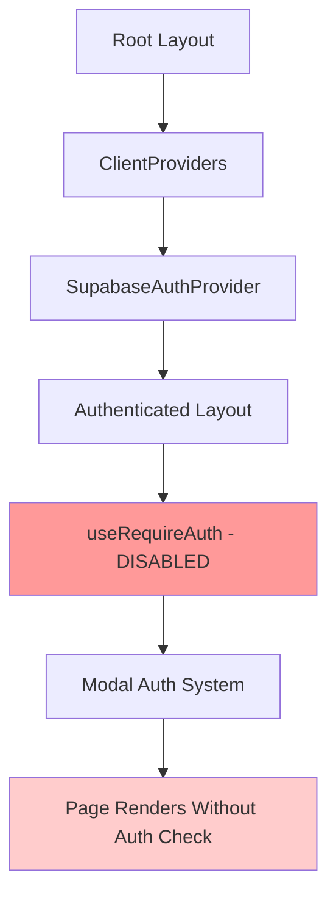

# LAYOUT ORCHESTRATION SUMMARY
**POWLAX Application Layout and Middleware Analysis**

*Generated: January 15, 2025*  
*Contract ID: page-orchestration-analysis-001*  
*Agent: Layout & Middleware Specialist*

---

## 🏗️ EXECUTIVE SUMMARY

This analysis documents the complete layout and middleware orchestration system for the POWLAX React application, revealing a sophisticated but security-compromised architecture. While the provider hierarchy and navigation system are well-designed, critical security gaps exist in page-level authentication enforcement.

### Key Findings
- **✅ Excellent**: Provider hierarchy and navigation system
- **⚠️ Critical Issue**: Authentication disabled at layout level
- **❌ Missing**: Server-side page protection middleware
- **✅ Strong**: API-level security implementation

---

## 🔄 COMPLETE PROVIDER HIERARCHY

### Provider Chain Flow
```
HTML Document (Server)
└── ClientProviders (Client Boundary)
    ├── 1. ThemeProvider (UI theming)
    ├── 2. OnboardingProvider (User journey)
    ├── 3. SidebarProvider (Navigation state)
    ├── 4. QueryProvider (Data management)
    ├── 5. SupabaseAuthProvider (Authentication)
    ├── 6. RoleViewerProvider (Admin tools)
    └── 7. ToasterProvider (Notifications)
```

### Provider Responsibilities

| Layer | Provider | Purpose | Performance | Dependencies |
|-------|----------|---------|-------------|--------------|
| 1 | ThemeProvider | Dark/light theme management | Lightweight | None |
| 2 | OnboardingProvider | User onboarding flow | Minimal | Theme |
| 3 | SidebarProvider | Navigation state | Very light | Theme |
| 4 | QueryProvider | Data fetching/caching | Heavy but essential | Previous layers |
| 5 | SupabaseAuthProvider | Authentication/session | Medium weight | Query layer |
| 6 | RoleViewerProvider | Admin role switching | Lightweight | Auth layer |
| 7 | ToasterProvider | Toast notifications | Lightweight | All providers |

---

## 🔐 AUTHENTICATION FLOW THROUGH LAYOUTS

### Current Authentication Architecture



### Critical Security Issue
```typescript
// CURRENT STATE - Authentication Bypassed
export default function AuthenticatedLayout({ children }) {
  // ⚠️ SECURITY ISSUE: Authentication check disabled
  // const { loading } = useRequireAuth() // COMMENTED OUT
  
  // Pages render immediately without authentication
  return (
    <SidebarProvider>
      <div className="flex h-screen bg-gray-100">
        <SidebarNavigation />
        <main className="flex-1 overflow-x-hidden overflow-y-auto bg-gray-100 pb-16 md:pb-0">
          {children} {/* ❌ Renders without auth verification */}
        </main>
        <BottomNavigation />
      </div>
    </SidebarProvider>
  )
}
```

---

## 🧭 NAVIGATION INTEGRATION PATTERNS

### Desktop Navigation Architecture
```
SidebarNavigation Component
├── Logo Section (Collapsible)
├── Search Bar (Hidden when collapsed)
├── Core Navigation Items
│   ├── Dashboard
│   ├── Teams
│   ├── Practice Planner
│   ├── Academy
│   └── Resources
├── Admin Section (Role-filtered)
│   ├── Management
│   ├── Drill Editor
│   ├── WP Import Check
│   └── Sync Data
└── User Profile Section
    ├── User Info
    ├── View-As Badge (if applicable)
    ├── Theme Toggle
    └── Logout Button
```

### Mobile Navigation
- **Bottom Navigation Bar**: Fixed position with core features
- **Responsive Breakpoint**: 768px (md breakpoint)
- **Content Padding**: `pb-16 md:pb-0` to accommodate bottom nav

### Navigation State Management
```typescript
// Sidebar state persistence
const [isCollapsed, setIsCollapsed] = useState(false)

// LocalStorage persistence
useEffect(() => {
  localStorage.setItem('powlax-sidebar-collapsed', JSON.stringify(isCollapsed))
}, [isCollapsed])
```

---

## 🔧 GLOBAL STATE INITIALIZATION

### State Categories and Providers

#### UI State
| Provider | Persistence | Purpose |
|----------|-------------|---------|
| ThemeProvider | localStorage | Dark/light theme preference |
| SidebarProvider | localStorage | Navigation collapse state |
| ToasterProvider | Memory | Toast notification queue |

#### User State
| Provider | Persistence | Purpose |
|----------|-------------|---------|
| SupabaseAuthProvider | Supabase + localStorage | User session and roles |
| RoleViewerProvider | Memory | Admin role switching |

#### Application State
| Provider | Persistence | Purpose |
|----------|-------------|---------|
| OnboardingProvider | User progress | Onboarding step tracking |
| QueryProvider | React Query cache | API data caching |

---

## 🛡️ SECURITY IMPLEMENTATION

### API-Level Security (Strong)
```typescript
// Role-based API protection
export const roleMiddleware = {
  adminOnly: (handler) => withRoleValidation(handler, { 
    allowedRoles: ['administrator'] 
  }),
  
  directorLevel: (handler) => withRoleValidation(handler, { 
    allowedRoles: ['administrator', 'club_director'],
    requireOrgScope: true 
  }),
  
  coachLevel: (handler) => withRoleValidation(handler, { 
    allowedRoles: ['administrator', 'club_director', 'team_coach'],
    requireTeamScope: true 
  })
}
```

### Page-Level Security (Missing)
```bash
# Missing file
❌ middleware.ts (root directory)

# Current situation
⚠️ src/app/(authenticated)/layout.tsx - Authentication disabled
⚠️ No server-side page protection
⚠️ Client-side auth bypass possible
```

---

## 🎭 ROLE-BASED UI ORCHESTRATION

### Admin Tools Integration
```typescript
// RoleViewerSelector - Admin role switching
export function RoleViewerSelector() {
  const { user } = useAuth()
  const isAdmin = user?.roles?.includes('administrator')
  
  // Only render for actual administrators
  if (!isAdmin) return null
  
  return (
    <div className="fixed top-0 left-1/2 transform -translate-x-1/2 z-[9999]">
      {/* Role switching interface */}
    </div>
  )
}
```

### Navigation Role Filtering
```typescript
// Admin section visibility
{isActualAdmin && !isViewingAs && (
  <>
    {/* Admin navigation items */}
    {adminItems.map((item) => (
      <Link href={item.href} key={item.name}>
        {/* Admin menu item */}
      </Link>
    ))}
  </>
)}
```

---

## ⚡ PERFORMANCE OPTIMIZATIONS

### Current Optimizations
- **Font Loading**: Next.js optimized Inter font loading
- **Provider Hierarchy**: Logical dependency ordering
- **Sidebar State**: Persistent localStorage state
- **Navigation**: Conditional rendering based on collapse state
- **Admin Tools**: Lazy rendering only for administrators

### Performance Metrics
| Component | Bundle Impact | Render Performance | Memory Usage |
|-----------|---------------|-------------------|--------------|
| Root Layout | Low | Excellent | Minimal |
| ClientProviders | Medium | Good | Moderate |
| SidebarNavigation | Medium | Good | Low |
| AuthProvider | High | Good | Medium |

---

## 🚨 CRITICAL ISSUES IDENTIFIED

### 1. Authentication Bypass (CRITICAL)
```typescript
// ISSUE: Authentication disabled in layout
// FILE: src/app/(authenticated)/layout.tsx
// RISK: Pages accessible without authentication
// IMPACT: Security vulnerability

// Current code:
// const { loading } = useRequireAuth() // ❌ COMMENTED OUT
```

### 2. Missing Server-Side Protection (HIGH)
```bash
# ISSUE: No middleware.ts file
# RISK: No server-side route protection
# IMPACT: Client-side auth can be bypassed
```

### 3. Error Boundary Gap (MEDIUM)
```typescript
// ISSUE: No global error boundary
// RISK: Provider failures crash entire app
// IMPACT: Poor user experience on errors
```

---

## 🔧 RECOMMENDED FIXES

### Immediate Actions (Critical)

#### 1. Implement Server-Side Page Protection
```typescript
// Create: middleware.ts
import { NextRequest, NextResponse } from 'next/server'
import { createMiddlewareClient } from '@supabase/auth-helpers-nextjs'

export async function middleware(req: NextRequest) {
  const res = NextResponse.next()
  const supabase = createMiddlewareClient({ req, res })
  
  const { data: { session } } = await supabase.auth.getSession()
  
  // Protected routes
  const protectedPaths = ['/dashboard', '/teams', '/admin', '/practiceplan']
  const isProtectedPath = protectedPaths.some(path => 
    req.nextUrl.pathname.startsWith(path)
  )
  
  if (isProtectedPath && !session) {
    return NextResponse.redirect(new URL('/auth/login', req.url))
  }
  
  return res
}

export const config = {
  matcher: ['/dashboard/:path*', '/teams/:path*', '/admin/:path*', '/practiceplan/:path*']
}
```

#### 2. Re-enable Layout Authentication
```typescript
// Fix: src/app/(authenticated)/layout.tsx
export default function AuthenticatedLayout({ children }) {
  const { loading } = useRequireAuth() // ✅ RE-ENABLE
  
  if (loading) {
    return <LoadingSpinner /> // ✅ PROPER LOADING STATE
  }
  
  return (
    <SidebarProvider>
      {/* Layout content */}
    </SidebarProvider>
  )
}
```

#### 3. Add Global Error Boundary
```typescript
// Create: src/components/providers/ErrorBoundary.tsx
export function GlobalErrorBoundary({ children }) {
  return (
    <ErrorBoundary
      fallback={<ErrorFallback />}
      onError={(error) => console.error('Global error:', error)}
    >
      {children}
    </ErrorBoundary>
  )
}
```

### Short-term Improvements

1. **Provider Performance**: Implement lazy loading for admin-only providers
2. **Navigation**: Split large navigation component into smaller modules
3. **Monitoring**: Add provider initialization monitoring
4. **Testing**: Create comprehensive provider testing utilities

---

## 📊 INTEGRATION MATRIX

### Page-to-Provider Dependencies

| Page Category | Theme | Sidebar | Auth | Query | RoleViewer | Toast |
|---------------|-------|---------|------|-------|------------|-------|
| Public Pages | ✅ | ❌ | ❌ | ✅ | ❌ | ✅ |
| Auth Pages | ✅ | ❌ | ✅ | ✅ | ❌ | ✅ |
| Dashboard | ✅ | ✅ | ✅ | ✅ | ✅* | ✅ |
| Team Pages | ✅ | ✅ | ✅ | ✅ | ✅* | ✅ |
| Admin Pages | ✅ | ✅ | ✅ | ✅ | ✅ | ✅ |

*Admin only

### Component-to-Layout Integration

| Component | Root Layout | Auth Layout | Navigation | Admin Tools |
|-----------|-------------|-------------|------------|-------------|
| SidebarNavigation | ❌ | ✅ | ✅ | ✅ |
| BottomNavigation | ❌ | ✅ | ✅ | ❌ |
| RoleViewerSelector | ❌ | ✅ | ❌ | ✅ |
| AuthModal | ✅ | ✅ | ❌ | ❌ |

---

## 🎯 SUCCESS METRICS

### Security Metrics
- [ ] **Page Protection**: All authenticated pages require server-side auth
- [ ] **API Security**: All API endpoints properly protected (✅ COMPLETE)
- [ ] **Role Enforcement**: Role-based access properly enforced
- [ ] **Audit Trail**: Security violations logged and monitored

### Performance Metrics
- [ ] **First Contentful Paint**: < 1.5s
- [ ] **Time to Interactive**: < 2s
- [ ] **Provider Initialization**: < 500ms
- [ ] **Navigation Response**: < 100ms

### User Experience Metrics
- [ ] **Authentication Flow**: Smooth, no infinite loading
- [ ] **Navigation**: Intuitive role-based navigation
- [ ] **Theme Switching**: Immediate theme application
- [ ] **Error Recovery**: Graceful error handling

---

## 🔍 MONITORING STRATEGY

### Key Monitoring Points
1. **Provider Initialization Time**: Track provider loading performance
2. **Authentication Failures**: Monitor auth bypass attempts
3. **Navigation Usage**: Track sidebar collapse/expand patterns
4. **Role Switching**: Monitor admin tool usage
5. **Error Boundaries**: Track provider failure patterns

### Alerting Triggers
- Authentication bypass attempts
- Provider initialization failures
- Unusual role switching patterns
- Navigation performance degradation
- Security violation spikes

---

## 📋 IMPLEMENTATION CHECKLIST

### Phase 1: Security Fixes (Critical - Complete First)
- [ ] Create `middleware.ts` for server-side protection
- [ ] Re-enable authentication in `AuthenticatedLayout`
- [ ] Add proper loading states for auth checks
- [ ] Test authentication flow end-to-end
- [ ] Verify admin tool access restrictions

### Phase 2: Error Handling (High Priority)
- [ ] Implement global error boundary
- [ ] Add provider error handling
- [ ] Create error fallback components
- [ ] Test error recovery scenarios

### Phase 3: Performance (Medium Priority)
- [ ] Implement provider lazy loading
- [ ] Add performance monitoring
- [ ] Optimize bundle splitting
- [ ] Monitor provider initialization times

### Phase 4: Enhancement (Low Priority)
- [ ] Add provider dependency validation
- [ ] Implement advanced security features
- [ ] Add comprehensive analytics
- [ ] Create provider documentation

---

## 📚 RELATED CONTRACTS

| Contract | Relationship | Status |
|----------|--------------|--------|
| `layout-root-contract.yaml` | Root layout analysis | ✅ Complete |
| `layout-authenticated-contract.yaml` | Auth layout analysis | ✅ Complete |
| `providers-contract.yaml` | Provider hierarchy | ✅ Complete |
| `middleware-analysis.yaml` | Security middleware | ✅ Complete |
| `component-evaluation-master-001` | Component integration | Referenced |

---

**🎯 CRITICAL NEXT STEP**: Implement server-side page protection (`middleware.ts`) and re-enable layout authentication before any other development work.