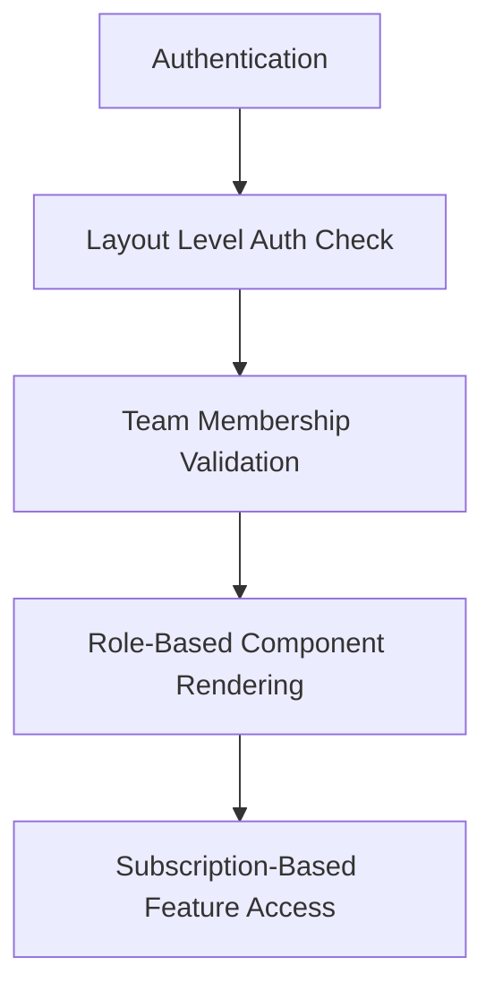
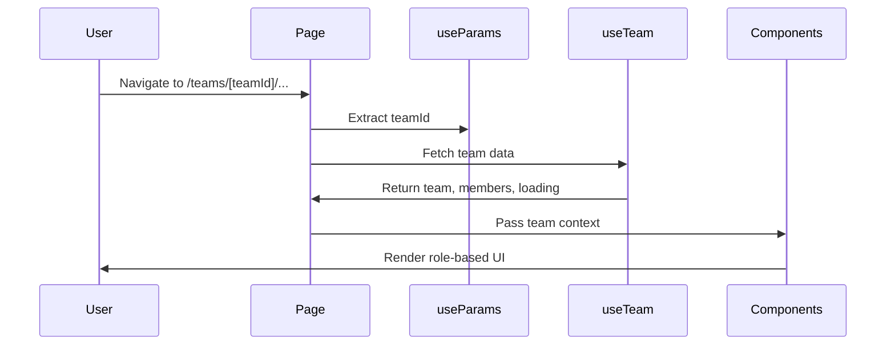
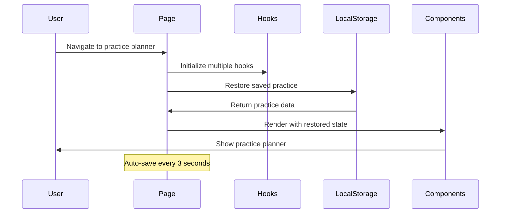

# Team Pages Orchestration Analysis Summary

**Analysis Date:** August 13, 2025  
**Scope:** Team management pages in `/src/app/(authenticated)/teams/`  
**Total Pages Analyzed:** 5 pages + 2 supporting files  

---

## 📋 Executive Summary

The team pages represent a sophisticated multi-role team management system with complex orchestration patterns. These pages handle dynamic routing with team context, role-based access control, subscription tier management, and both team-based and no-team workflows.

### Key Findings
- **Complex Role-Based Orchestration**: Dashboard implements Coach/Parent/Player views
- **Subscription Tier Management**: HQ page implements feature gating based on subscription
- **No-Team Workflow Support**: Practice planner supports standalone usage
- **Critical Database Issues**: Playbook page references non-existent table
- **Comprehensive Auto-Save**: Practice planner implements sophisticated state persistence

---

## 🗂️ Page Analysis Overview

| Page | Route | Complexity | Status | Key Features |
|------|-------|------------|--------|--------------|
| Teams List | `/teams` | Medium | ✅ Working | Team discovery, member counts, no-team support |
| Team Dashboard | `/teams/[teamId]/dashboard` | High | ✅ Working | Multi-role views, comprehensive dashboard |
| Team HQ | `/teams/[teamId]/hq` | Medium | ✅ Working | Feature hub, subscription gating |
| Practice Planner | `/teams/[teamId]/practiceplan` | Very High | ✅ Working | Complex workflow, auto-save, modal orchestra |
| Team Playbook | `/teams/[teamId]/playbook` | Low | ❌ Broken | Database table error, minimal functionality |

---

## 🔄 Dynamic Routing Analysis

### Route Parameter Handling
All team pages use `[teamId]` dynamic parameter with consistent patterns:

```typescript
// Standard pattern across all pages
const params = useParams()
const teamId = params.teamId as string

// Special case in practice planner
if (teamId === 'no-team') {
  teamId = undefined as any // Supports standalone usage
}
```

### Team Context Validation
- **Teams List**: No validation (shows user's teams only)
- **Dashboard**: Full validation via `useTeam` hook with error handling
- **HQ**: Full validation via `useTeam` hook with error handling  
- **Practice Planner**: Optional validation (supports no-team)
- **Playbook**: Broken validation (wrong table name)

### Route Protection


---

## 👥 Team Context Propagation Patterns

### Data Fetching Strategy
1. **Primary Hook**: `useTeam(teamId)` provides team data and member list
2. **Secondary Hooks**: Page-specific hooks for dashboard data, practice plans, etc.
3. **Direct Queries**: Limited use (teams list member counts, broken playbook query)

### Context Flow
```typescript
// Standard pattern
const { team, members, loading, error } = useTeam(teamId)

// Role determination
const userRole = members.find(m => m.user_id === user?.id)?.role
const isCoach = userRole && ['head_coach', 'assistant_coach', 'team_admin'].includes(userRole)

// Data propagation to components
<ComponentName 
  team={team}
  userRole={userRole}
  members={members}
  canManage={isCoach}
/>
```

### Team Data Structure
```typescript
interface Team {
  id: string
  name: string
  club_id: string
  age_group?: string
  level?: string
  subscription_tier: 'structure' | 'leadership' | 'activated'
  organization?: { name: string }
}

interface TeamMember {
  user_id: string
  role: 'head_coach' | 'assistant_coach' | 'team_admin' | 'player' | 'parent'
  // ... other member data
}
```

---

## 🎭 Multi-Role View Orchestration

### Role Detection Pattern
All team pages implement consistent role detection:

```typescript
const userRole = members.find(m => m.user_id === user?.id)?.role
const isCoach = userRole && ['head_coach', 'assistant_coach', 'team_admin'].includes(userRole)
const isPlayer = userRole === 'player'
const isParent = userRole === 'parent'
```

### Role-Based Rendering

#### Dashboard Multi-View Architecture
```typescript
// Coach View (Default/Primary)
return (
  <div>
    <TeamHeader />
    <CoachQuickActions />
    <UpcomingSchedule />
    <TeamRoster />
    <TeamPlaybookSection />
    <ProgressOverview />
    <RecentActivity />
  </div>
)

// Parent View
return (
  <div>
    <TeamHeader />
    <ParentView playerMembers={filteredPlayers} />
  </div>
)

// Player View (Age-Based)
const ageGroup = calculateAgeGroup(team.age_group) // youth/middle/teen
return (
  <div>
    <TeamHeader />
    <PlayerView ageGroup={ageGroup} />
  </div>
)
```

### Permission-Based Features
- **canManage**: Coach-only administrative actions
- **canTakeAttendance**: Roster management capabilities
- **viewDetails**: Role-appropriate data visibility
- **featureAccess**: Subscription + role combination

---

## 💰 Subscription Tier Orchestration

### Tier Levels and Feature Access

| Feature | Structure | Leadership | Activated |
|---------|-----------|------------|-----------|
| Practice Planner | ✅ | ✅ | ✅ |
| Team Playbook | ✅ | ✅ | ✅ |
| Team Roster | ✅ | ✅ | ✅ |
| Team Communications | ❌ | ✅ | ✅ |
| Team Analytics | ❌ | ✅ | ✅ |
| Skills Academy | ❌ | ❌ | ✅ |

### Feature Gating Implementation
```typescript
// HQ Page Feature Gating
const sections = [
  {
    title: 'Team Communications',
    available: ['leadership', 'activated'].includes(team.subscription_tier),
    badge: team.subscription_tier === 'structure' ? 'Leadership' : undefined,
  },
  {
    title: 'Skills Academy', 
    available: team.subscription_tier === 'activated',
    badge: team.subscription_tier !== 'activated' ? 'Activated' : undefined,
  }
]
```

### Visual Treatment
- **Available Features**: Full color, hover effects, clickable
- **Restricted Features**: Reduced opacity, disabled cursor, upgrade badges
- **Upgrade CTA**: Gradient background for structure tier users

---

## 🔄 Data Fetching Strategies

### Client-Side Fetching Patterns

#### Teams List Page
```typescript
// 1. Initial teams via hook
const { teams, loading, error } = useTeams()

// 2. Enrich with member counts
useEffect(() => {
  const { data: teamCounts } = await supabase
    .from('teams')
    .select(`id, name, club_id, clubs:club_id(name), team_members(count)`)
  // Process and enhance team data
}, [teams])
```

#### Dashboard Page
```typescript
// Parallel data fetching
const { team, members, loading: teamLoading } = useTeam(teamId)
const { upcomingEvents, teamStats, recentActivity, loading: dashboardLoading } = useTeamDashboard(teamId)

// Combined loading state
if (teamLoading || dashboardLoading) { /* loading UI */ }
```

#### Practice Planner Page
```typescript
// Multiple specialized hooks
const { savePracticePlan, plans } = usePracticePlans(teamId)
const { drills, refreshDrills } = useDrills()
const { refreshStrategies } = useStrategies()
const { isPrinting, printContent } = usePrint()
```

### Error Handling Strategies
1. **Hook-Level**: Each hook manages its own error state
2. **Page-Level**: Combined error display with navigation fallbacks
3. **Component-Level**: Graceful degradation for missing data
4. **Error Boundaries**: Practice planner has dedicated error.tsx

---

## 🚀 Component Initialization Flows

### Standard Team Page Flow


### Practice Planner Initialization


### No-Team Workflow
```typescript
// Special handling in practice planner
let teamId = params.teamId as string
if (teamId === 'no-team') {
  teamId = undefined as any // Enables standalone usage
}

// Hooks handle undefined teamId gracefully
const { savePracticePlan } = usePracticePlans(teamId) // Works with or without team
```

---

## 📱 Responsive Orchestration

### Mobile Optimizations

#### Practice Planner Mobile
- **Drill Library**: Full-screen modal instead of sidebar
- **Action Buttons**: Bottom-positioned floating buttons  
- **Print**: Direct print without preview
- **Toolbar**: Condensed icon-only toolbar

#### Dashboard Mobile
- **Layout**: Single column instead of two-column
- **Touch Targets**: Large buttons for field use
- **Emergency Contacts**: Quick access in header
- **Quick Actions**: Prominent coach actions

### Responsive Patterns
```typescript
// Standard responsive pattern
<div className="grid gap-6 lg:grid-cols-3"> {/* Desktop: 3 columns */}
  <div className="lg:col-span-2"> {/* Main content */}
    {/* Priority information */}
  </div>
  <div> {/* Sidebar content */}
    {/* Secondary information */}
  </div>
</div>

// Mobile-specific components
{showDrillLibrary && (
  <div className="fixed inset-0 bg-black bg-opacity-50 z-50 md:hidden">
    {/* Mobile modal */}
  </div>
)}
<div className="hidden md:block w-80 lg:w-96"> {/* Desktop sidebar */}
```

---

## 🔧 State Management Patterns

### Local State Complexity

#### Practice Planner (Most Complex)
- **Practice Metadata**: Date, time, duration, field, notes
- **Time Slots**: Array of drill sequences with durations
- **Strategies**: Selected strategies for practice focus
- **Modal States**: 8+ boolean states for different modals
- **UI States**: Loading, printing, refreshing states

#### Dashboard (Role-Based)
- **User Role**: Calculated from team members
- **View Type**: Coach/Parent/Player determination
- **Age Group**: Calculated for player view customization
- **Loading States**: Coordinated across multiple hooks

### Auto-Save Implementation
```typescript
// Debounced auto-save with 3-second delay
useEffect(() => {
  if (autoSaveTimerRef.current) {
    clearTimeout(autoSaveTimerRef.current)
  }

  autoSaveTimerRef.current = setTimeout(() => {
    const practiceData = { /* all practice state */ }
    localStorage.setItem(`practice-plan-${teamId}`, JSON.stringify(practiceData))
  }, 3000)

  return () => clearTimeout(autoSaveTimerRef.current)
}, [/* all practice state dependencies */])
```

### State Restoration
```typescript
// Load saved practice on mount
useEffect(() => {
  const savedData = localStorage.getItem(`practice-plan-${teamId}`)
  if (savedData) {
    const data = JSON.parse(savedData)
    // Restore all practice state
    toast.success('Previous practice session restored')
  }
}, [teamId])
```

---

## ⚠️ Critical Issues Identified

### 1. Database Table Reference Error (Playbook)
**Problem**: References non-existent `team_teams` table
```typescript
// ❌ Current (Broken)
const { data, error } = await supabase
  .from('team_teams') // This table doesn't exist
  .select('id, name')

// ✅ Should be
const { data, error } = await supabase
  .from('teams') // Correct table name
  .select('id, name')
```

**Impact**: Playbook page completely broken for all users

### 2. Missing Team Membership Validation (Playbook)
**Problem**: No validation that user is team member
**Solution**: Use `useTeam` hook like other pages

### 3. Inconsistent Error Handling
**Problem**: Varying error handling patterns across pages
**Solution**: Standardize error boundaries and fallback patterns

---

## 🎯 Performance Characteristics

### Loading Patterns
- **Teams List**: Sequential loading (teams → member counts)
- **Dashboard**: Parallel loading (team data + dashboard data)
- **HQ**: Single hook loading (team data only)
- **Practice Planner**: Multiple hook loading with skeleton UI
- **Playbook**: Simple loading (broken due to table error)

### Optimization Opportunities
1. **Prefetching**: Team data could be prefetched on teams list
2. **Caching**: Implement query caching for frequently accessed team data
3. **Code Splitting**: Practice planner modals could be lazy loaded
4. **Virtualization**: Large team rosters could benefit from virtualization

---

## 🔐 Security Analysis

### Authentication
- ✅ All pages protected by layout-level authentication
- ✅ Redirects to `/auth/login` for unauthenticated users

### Authorization
- ✅ **Dashboard**: Full team membership validation
- ✅ **HQ**: Full team membership validation  
- ✅ **Teams List**: Shows only user's teams
- ⚠️ **Practice Planner**: Optional validation (by design for no-team)
- ❌ **Playbook**: Missing team membership validation

### Role-Based Access
- ✅ **Dashboard**: Comprehensive role-based rendering
- ✅ **HQ**: Subscription-based feature access
- ⚠️ **Practice Planner**: Limited role consideration
- ❌ **Playbook**: No role-based restrictions

---

## 🔄 Navigation Flow Patterns

### Team Selection Flow
```
/teams (list) → /teams/[teamId]/dashboard (entry point) → feature pages
```

### Cross-Feature Navigation
```
Dashboard → HQ → Feature Pages → Back to Dashboard
Dashboard → Practice Planner → Back to Dashboard  
HQ → Practice Planner (via Add Strategy)
```

### Error Recovery Flows
```
Error State → Back to Teams List
Team Not Found → Teams List
Permission Denied → Teams List
```

---

## 🚀 Recommendations

### Immediate Fixes (Critical)
1. **Fix Playbook Database Reference**: Change `team_teams` to `teams`
2. **Add Playbook Team Validation**: Implement `useTeam` hook
3. **Standardize Error Boundaries**: Add error.tsx to all team pages

### Short-Term Improvements
1. **Implement Loading States**: Add loading.tsx to dashboard and HQ
2. **Standardize Hook Usage**: Use `useTeam` consistently across all pages
3. **Add Role Validation**: Implement role-based access where missing

### Long-Term Enhancements
1. **Performance Optimization**: Implement caching and prefetching
2. **Real-time Updates**: Add real-time subscriptions for team data
3. **Progressive Enhancement**: Improve offline capabilities
4. **Analytics Integration**: Add page-level analytics tracking

---

## 📊 Integration Matrix

### Page ↔ Component Integration
- **Teams List**: Minimal components (Cards, Buttons, Icons)
- **Dashboard**: Heavy component integration (6 major dashboard components)
- **HQ**: UI-focused components (Cards, Badges, Navigation)
- **Practice Planner**: Complex component orchestra (15+ components)
- **Playbook**: Single major component (TeamPlaybook)

### Page ↔ Hook Integration
- **Teams List**: `useTeams` + direct queries
- **Dashboard**: `useTeam` + `useTeamDashboard` + `useSupabase`
- **HQ**: `useTeam` only
- **Practice Planner**: 6+ specialized hooks
- **Playbook**: Direct queries (problematic)

### Page ↔ Database Integration
- All pages rely heavily on `teams` and `team_members` tables
- Practice planner integrates with `practices`, `powlax_drills`, `powlax_strategies`
- Dashboard uses additional activity and events tables

---

## 🎯 Success Criteria Assessment

### Functional Completeness: 80%
- ✅ Teams list works well
- ✅ Dashboard fully functional with multi-role support  
- ✅ HQ provides comprehensive feature navigation
- ✅ Practice planner is feature-complete and sophisticated
- ❌ Playbook broken due to database errors

### Quality Standards: 75%
- ✅ Good responsive design across all pages
- ✅ Consistent role-based access patterns
- ✅ Comprehensive error handling (except playbook)
- ⚠️ Some performance optimization opportunities
- ❌ Database integration issues in playbook

### Integration Quality: 85%
- ✅ Strong component integration patterns
- ✅ Effective hook-based data management
- ✅ Good navigation flow between pages
- ✅ Consistent team context propagation
- ⚠️ Some inconsistencies in validation patterns

---

## 📈 Conclusion

The team pages represent a sophisticated team management system with advanced orchestration patterns. The multi-role dashboard and comprehensive practice planner demonstrate excellent architecture and user experience design. However, critical database integration issues in the playbook page need immediate attention.

The pages successfully handle complex requirements including dynamic routing, role-based access, subscription tiers, and no-team workflows. With the identified critical fixes, this system provides a solid foundation for team management functionality.

**Next Steps**: Address critical database issues, standardize error handling patterns, and implement performance optimizations for a production-ready team management system.