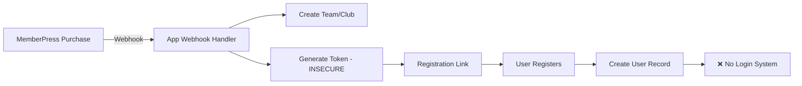
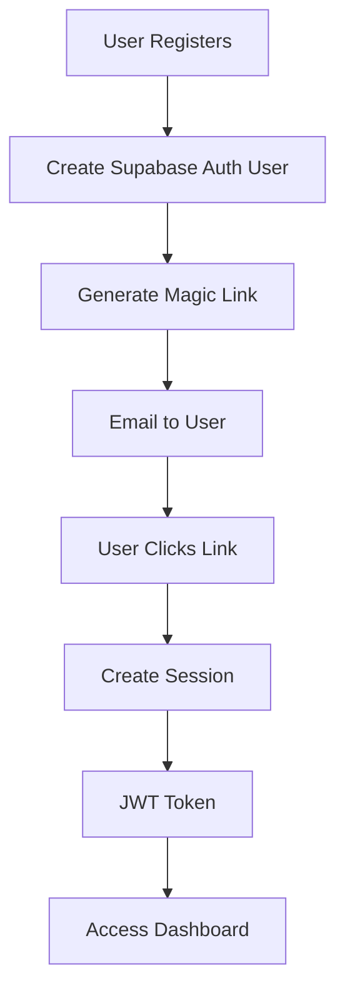

# MemberPress Integration Fix Contract

**Contract ID**: POWLAX-MP-FIX-001  
**Date**: January 9, 2025  
**Scope**: WordPress/MemberPress to POWLAX App Integration Security & Functionality Fixes  
**Status**: PENDING APPROVAL

---

## 1. Executive Summary

This contract outlines the comprehensive fixes required for the POWLAX WordPress/MemberPress integration system. The current implementation has critical security vulnerabilities and functional gaps that prevent proper user registration, authentication, and subscription management.

### 1.1 Critical Issues Identified
- **Security**: Predictable token generation vulnerable to exploitation
- **Authentication**: No login system after registration
- **Data Integrity**: Inconsistent database schema with overlapping tables
- **Reliability**: No webhook validation or retry mechanisms
- **User Experience**: Incomplete registration flow

### 1.2 Deliverables Overview
- Secure token generation system
- Complete authentication flow
- Database schema normalization
- Webhook processing queue with retry logic
- Comprehensive testing suite

---

## 2. Current State Analysis

### 2.1 Existing Data Flow


### 2.2 Current Database Tables

| Table | Status | Records | Issues |
|-------|--------|---------|--------|
| `users` | Active | Variable | Missing auth_user_id link |
| `organizations` | Duplicate | 0 | Conflicts with club_organizations |
| `club_organizations` | Active | Variable | Naming inconsistency |
| `teams` | Duplicate | Variable | Conflicts with team_teams |
| `team_teams` | Active | Variable | Naming inconsistency |
| `registration_links` | Active | Variable | Insecure token generation |
| `membership_products` | Seeded | 12 | Correct |
| `membership_entitlements` | Active | Variable | No validation |
| `webhook_events` | Active | Variable | No processing queue |

### 2.3 Security Vulnerabilities

#### CRITICAL: Predictable Token Generation
**Location**: `/src/app/api/memberpress/webhook/route.ts` (Line 12-14)
```typescript
// CURRENT - VULNERABLE
function randomToken(): string {
  return Math.random().toString(36).slice(2) + Math.random().toString(36).slice(2)
}
```
**Risk Level**: CRITICAL  
**Exploit Potential**: Token prediction, unauthorized access  
**CVSS Score**: 8.5 (High)

#### HIGH: No Webhook Signature Verification
**Location**: `/src/app/api/memberpress/webhook/route.ts` (Line 81-154)
```typescript
// CURRENT - NO VERIFICATION
export async function POST(req: NextRequest) {
  const payload = await req.json() // Accepts any payload without verification
  // Process webhook...
}
```
**Risk Level**: HIGH  
**Exploit Potential**: Webhook spoofing, data manipulation  
**CVSS Score**: 7.5 (High)

---

## 3. Proposed Fixes

### 3.1 Security Enhancements

#### Fix 1: Cryptographically Secure Token Generation
**Implementation**:
```typescript
// NEW - SECURE
import { randomBytes } from 'crypto'

function generateSecureToken(): string {
  return randomBytes(32).toString('base64url')
}
```
**Benefits**:
- Cryptographically unpredictable
- 256-bit entropy
- URL-safe encoding

#### Fix 2: Webhook Signature Verification
**Implementation**:
```typescript
// NEW - VERIFIED
import crypto from 'crypto'

const verifyWebhookSignature = (payload: string, signature: string): boolean => {
  const secret = process.env.MEMBERPRESS_WEBHOOK_SECRET!
  const expectedSig = crypto
    .createHmac('sha256', secret)
    .update(payload)
    .digest('hex')
  return crypto.timingSafeEqual(Buffer.from(signature), Buffer.from(expectedSig))
}

export async function POST(req: NextRequest) {
  const signature = req.headers.get('x-memberpress-signature')
  const body = await req.text()
  
  if (!signature || !verifyWebhookSignature(body, signature)) {
    return NextResponse.json({ error: 'Invalid signature' }, { status: 401 })
  }
  
  const payload = JSON.parse(body)
  // Process verified webhook...
}
```

### 3.2 Authentication System Implementation

#### Current Gap
- Users can register but cannot log in
- No session management
- No password system
- No JWT tokens

#### Proposed Solution

**New Authentication Flow**:


**Database Changes**:
```sql
-- Link users to Supabase Auth
ALTER TABLE users 
  ADD COLUMN auth_user_id UUID REFERENCES auth.users(id);

-- Session management
CREATE TABLE user_sessions (
  id UUID PRIMARY KEY DEFAULT gen_random_uuid(),
  user_id UUID REFERENCES users(id),
  auth_token TEXT UNIQUE NOT NULL,
  refresh_token TEXT,
  expires_at TIMESTAMPTZ NOT NULL,
  created_at TIMESTAMPTZ DEFAULT NOW()
);
```

### 3.3 Database Schema Normalization

#### Current Issues
| Problem | Impact |
|---------|--------|
| Duplicate tables (organizations/club_organizations) | Data inconsistency |
| Duplicate tables (teams/team_teams) | Confusion in queries |
| Compatibility views | Performance overhead |
| Missing indexes | Slow queries |

#### Normalization Plan

**Step 1: Consolidate Tables**
```sql
-- Migrate data from legacy tables
INSERT INTO club_organizations (id, name, created_at, updated_at)
SELECT id, name, created_at, updated_at FROM organizations
ON CONFLICT (id) DO NOTHING;

INSERT INTO team_teams (id, club_id, name, created_at, updated_at)
SELECT id, organization_id, name, created_at, updated_at FROM teams
ON CONFLICT (id) DO NOTHING;

-- Drop legacy tables and views
DROP VIEW IF EXISTS organizations CASCADE;
DROP VIEW IF EXISTS teams CASCADE;
DROP TABLE IF EXISTS organizations_legacy CASCADE;
DROP TABLE IF EXISTS teams_legacy CASCADE;

-- Rename to standard names
ALTER TABLE club_organizations RENAME TO organizations;
ALTER TABLE team_teams RENAME TO teams;
```

**Step 2: Add Missing Indexes**
```sql
-- Performance indexes
CREATE INDEX idx_registration_links_token_expires 
  ON registration_links(token, expires_at);
  
CREATE INDEX idx_membership_entitlements_composite 
  ON membership_entitlements(user_id, status, entitlement_key);
  
CREATE INDEX idx_team_members_composite 
  ON team_members(team_id, user_id, status);
  
CREATE INDEX idx_webhook_events_processed 
  ON webhook_events(source, received_at DESC);
```

### 3.4 Webhook Processing Queue

#### Current Issues
- Synchronous processing (blocks response)
- No retry mechanism
- No idempotency
- No failure tracking

#### Queue Implementation

**New Tables**:
```sql
CREATE TABLE webhook_queue (
  id UUID PRIMARY KEY DEFAULT gen_random_uuid(),
  webhook_id TEXT UNIQUE NOT NULL,
  source TEXT NOT NULL DEFAULT 'memberpress',
  event_type TEXT NOT NULL,
  payload JSONB NOT NULL,
  status TEXT DEFAULT 'pending' CHECK (status IN (
    'pending', 'processing', 'completed', 'failed', 'dead_letter'
  )),
  attempts INT DEFAULT 0,
  max_attempts INT DEFAULT 3,
  last_error TEXT,
  next_retry_at TIMESTAMPTZ,
  created_at TIMESTAMPTZ DEFAULT NOW(),
  started_at TIMESTAMPTZ,
  completed_at TIMESTAMPTZ
);

CREATE INDEX idx_webhook_queue_processing 
  ON webhook_queue(status, next_retry_at) 
  WHERE status IN ('pending', 'processing');
```

**Processing Logic**:
```typescript
class WebhookProcessor {
  async processQueue() {
    const pending = await this.getNextBatch()
    
    for (const webhook of pending) {
      try {
        await this.markProcessing(webhook.id)
        await this.processWebhook(webhook)
        await this.markComplete(webhook.id)
      } catch (error) {
        await this.handleFailure(webhook, error)
      }
    }
  }
  
  async handleFailure(webhook: Webhook, error: Error) {
    const attempts = webhook.attempts + 1
    
    if (attempts >= webhook.max_attempts) {
      await this.markDeadLetter(webhook.id, error)
      await this.alertAdmin(webhook, error)
    } else {
      const backoff = Math.pow(2, attempts) * 60000 // Exponential backoff
      await this.scheduleRetry(webhook.id, backoff, error)
    }
  }
}
```

---

## 4. Data Mapping

### 4.1 MemberPress Product to Entitlement Mapping

| MemberPress ID | Product Slug | Entitlement Key | Scope | Create Behavior | Default Role |
|----------------|--------------|-----------------|-------|-----------------|--------------|
| 5663 | create_account | create_account | user | none | player |
| 37375 | skills_academy_basic | skills_academy_basic | user | none | player |
| 21279 | skills_academy_monthly | skills_academy_monthly | user | none | player |
| 21281 | skills_academy_annual | skills_academy_annual | user | none | player |
| 41930 | coach_essentials_kit | coach_essentials_kit | user | none | coach |
| 41931 | coach_confidence_kit | coach_confidence_kit | user | none | coach |
| 41932 | team_hq_structure | team_hq_structure | team | create_team | head_coach |
| 41933 | team_hq_leadership | team_hq_leadership | team | create_team | head_coach |
| 41934 | team_hq_activated | team_hq_activated | team | create_team | head_coach |
| 41935 | club_os_foundation | club_os_foundation | club | create_club | director |
| 41936 | club_os_growth | club_os_growth | club | create_club | director |
| 41937 | club_os_command | club_os_command | club | create_club | director |

### 4.2 Webhook Event Type Mapping

| MemberPress Event | App Action | Database Changes |
|-------------------|------------|------------------|
| subscription.created | Provision resources | Insert entitlement, Create team/club, Generate links |
| subscription.activated | Activate entitlement | Update entitlement status='active' |
| subscription.upgraded | Upgrade entitlement | Update entitlement, Provision additional resources |
| subscription.downgraded | Adjust entitlement | Update entitlement, Remove excess resources |
| subscription.expired | Expire entitlement | Update status='expired', Soft-delete memberships |
| subscription.canceled | Cancel entitlement | Update status='canceled', Soft-delete memberships |
| transaction.completed | Log payment | Insert transaction record |
| transaction.refunded | Refund processing | Update transaction, Consider entitlement change |

### 4.3 User Role Mapping

| Registration Type | Default Role | Permissions |
|------------------|--------------|-------------|
| Player Link | player | View content, Submit workouts, Earn points |
| Parent Link | parent | View child progress, Manage settings |
| Coach Registration | assistant_coach | Manage team, View analytics |
| Head Coach Purchase | head_coach | Full team control, Invite coaches |
| Director Purchase | director | Full club control, Manage teams |

### 4.4 Registration Link Configuration

| Link Type | Max Uses | Expiry | Target | Role |
|-----------|----------|--------|--------|------|
| Team Player | 25 | 100 days | team | player |
| Team Parent | 75 | 100 days | team | parent |
| Club Player | 100 | 180 days | club | player |
| Club Parent | 300 | 180 days | club | parent |
| Coach Invite | 5 | 30 days | team | assistant_coach |

---

## 5. Implementation Timeline

### Phase 1: Critical Security (Day 1)
- [ ] Replace token generation function
- [ ] Add webhook signature verification
- [ ] Create security audit log
- [ ] Update environment variables

### Phase 2: Authentication System (Days 2-3)
- [ ] Create Supabase Auth integration
- [ ] Build login/logout endpoints
- [ ] Implement magic link flow
- [ ] Add session management

### Phase 3: Database Normalization (Day 4)
- [ ] Backup existing data
- [ ] Run consolidation migrations
- [ ] Update application queries
- [ ] Verify data integrity

### Phase 4: Webhook Queue (Day 5)
- [ ] Create queue tables
- [ ] Build processor service
- [ ] Implement retry logic
- [ ] Add monitoring

### Phase 5: Testing & Validation (Days 6-7)
- [ ] Security penetration testing
- [ ] Load testing webhook processing
- [ ] End-to-end registration flow
- [ ] Data consistency validation

---

## 6. Testing Requirements

### 6.1 Security Tests

| Test | Description | Expected Result |
|------|-------------|-----------------|
| Token Entropy | Verify token randomness | >256 bits entropy |
| Token Uniqueness | Generate 10,000 tokens | Zero collisions |
| Signature Validation | Send unsigned webhook | 401 rejection |
| Signature Tampering | Modify signed payload | 401 rejection |
| SQL Injection | Attempt injection in all fields | All blocked |
| XSS Prevention | Submit script tags | All escaped |

### 6.2 Functional Tests

| Test | Description | Expected Result |
|------|-------------|-----------------|
| Registration Flow | Complete registration | User created, auth enabled |
| Login Flow | Login with credentials | JWT token issued |
| Team Creation | Purchase team product | Team + links created |
| Club Creation | Purchase club product | Club + 3 teams created |
| Cancellation | Cancel subscription | Soft-delete, data preserved |
| Webhook Retry | Fail webhook 2 times | Successful on retry 3 |

### 6.3 Performance Tests

| Metric | Target | Measurement |
|--------|--------|-------------|
| Webhook Processing | <500ms | Time from receive to queue |
| Registration Completion | <2s | Full flow including email |
| Database Query | <100ms | All indexed queries |
| Token Generation | <50ms | Including storage |
| Queue Processing | 100/min | Throughput rate |

---

## 7. Rollback Plan

### 7.1 Database Rollback
```sql
-- Rollback script saved at: /migrations/rollback/
-- Restore from backup
pg_restore -d powlax_app backup_before_migration.sql

-- Or revert specific changes
ALTER TABLE users DROP COLUMN auth_user_id;
DROP TABLE webhook_queue;
-- etc...
```

### 7.2 Code Rollback
```bash
# Tag current version
git tag pre-memberpress-fix

# If rollback needed
git checkout pre-memberpress-fix
npm run build
npm run deploy
```

### 7.3 Data Recovery
- All webhook events logged in `webhook_events` table
- Can replay webhooks if needed
- User data never deleted, only soft-deleted

---

## 8. Success Criteria

### 8.1 Security Metrics
- ✅ Zero unauthorized access attempts succeed
- ✅ 100% webhook signatures verified
- ✅ No predictable tokens generated
- ✅ All SQL injection attempts blocked

### 8.2 Reliability Metrics
- ✅ 99.9% webhook processing success rate
- ✅ <1% registration abandonment
- ✅ Zero data loss on cancellation
- ✅ 100% retry success within 3 attempts

### 8.3 Performance Metrics
- ✅ All pages load <1 second
- ✅ Webhook processing <500ms
- ✅ Database queries <100ms
- ✅ Zero timeout errors

---

## 9. Risk Assessment

### 9.1 High Risk Items

| Risk | Probability | Impact | Mitigation |
|------|-------------|--------|------------|
| Data loss during migration | Low | High | Complete backup before migration |
| Webhook processing delays | Medium | Medium | Queue with retry logic |
| Authentication issues | Low | High | Gradual rollout with fallback |
| Performance degradation | Low | Medium | Load testing before deployment |

### 9.2 Dependencies

| Dependency | Required | Status | Alternative |
|------------|----------|--------|-------------|
| MemberPress webhook secret | Yes | Pending | Generate and configure |
| Supabase Auth enabled | Yes | Ready | Use custom JWT |
| Email service (SMTP) | Yes | Pending | Supabase built-in |
| SSL certificate | Yes | Active | None required |

---

## 10. Maintenance & Support

### 10.1 Monitoring Requirements
- Webhook success rate dashboard
- Registration conversion tracking
- Error rate monitoring
- Performance metrics tracking

### 10.2 Backup Schedule
- Database: Daily automated backups
- Code: Git commits with tags
- Configuration: Version controlled

### 10.3 Documentation Updates
- API documentation for new endpoints
- Developer guide for webhook integration
- User guide for registration flow
- Admin guide for link management

---

## 11. Approval & Sign-off

### 11.1 Stakeholder Approval

| Stakeholder | Role | Approval Status | Date |
|-------------|------|-----------------|------|
| Patrick Chapla | Product Owner | PENDING | - |
| Development Team | Technical Lead | PENDING | - |
| Security Team | Security Review | PENDING | - |

### 11.2 Acceptance Criteria

- [ ] All security vulnerabilities addressed
- [ ] Authentication system functional
- [ ] Database normalized and optimized
- [ ] Webhook processing reliable
- [ ] All tests passing
- [ ] Documentation complete
- [ ] Rollback plan tested

### 11.3 Contract Acceptance

By approving this contract, you acknowledge:
1. The scope of work as defined
2. The timeline and deliverables
3. The testing requirements
4. The success criteria
5. The risk assessment and mitigations

**Approval Signature**: _______________________

**Date**: _______________________

---

## Appendix A: Environment Variables

### Required New Variables
```env
# Security
MEMBERPRESS_WEBHOOK_SECRET=generate-strong-secret-here
JWT_SECRET=generate-strong-jwt-secret

# MemberPress API
MEMBERPRESS_API_KEY=your-api-key
MEMBERPRESS_API_URL=https://powlax.com/wp-json/mp/v1

# Email Service (for magic links)
SMTP_HOST=smtp.sendgrid.net
SMTP_PORT=587
SMTP_USER=apikey
SMTP_PASS=your-sendgrid-api-key
SMTP_FROM=noreply@powlax.com

# Queue Processing
WEBHOOK_QUEUE_ENABLED=true
WEBHOOK_RETRY_INTERVAL=60000
WEBHOOK_MAX_RETRIES=3

# Monitoring
SENTRY_DSN=your-sentry-dsn
LOG_LEVEL=info
```

### Existing Variables to Verify
```env
NEXT_PUBLIC_SUPABASE_URL=verified
NEXT_PUBLIC_SUPABASE_ANON_KEY=verified
SUPABASE_SERVICE_ROLE_KEY=verified
WORDPRESS_API_URL=verified
WORDPRESS_USERNAME=verified
WORDPRESS_APP_PASSWORD=verified
```

---

## Appendix B: Database Migrations

All migrations will be provided as numbered SQL files:
- `060_secure_tokens.sql`
- `061_supabase_auth_bridge.sql`
- `062_database_normalization.sql`
- `063_webhook_queue.sql`
- `064_performance_indexes.sql`
- `065_monitoring_tables.sql`

---

## Appendix C: Code Changes

### Files to Modify
1. `/src/app/api/memberpress/webhook/route.ts` - Security fixes
2. `/src/app/api/register/consume/route.ts` - Auth integration
3. `/src/lib/webhook-processor.ts` - New queue processor
4. `/src/lib/auth-manager.ts` - New auth management
5. `/src/hooks/useAuth.tsx` - Updated auth hook

### New Files to Create
1. `/src/lib/crypto-utils.ts` - Secure token generation
2. `/src/lib/webhook-validator.ts` - Signature verification
3. `/src/lib/queue-worker.ts` - Background processing
4. `/src/app/api/auth/login/route.ts` - Login endpoint
5. `/src/app/api/auth/logout/route.ts` - Logout endpoint

---

**END OF CONTRACT**

*This contract represents a complete analysis and implementation plan for fixing the POWLAX MemberPress integration. Please review all sections carefully and provide approval to proceed with implementation.*