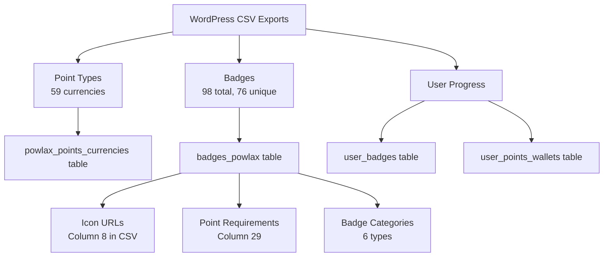

# GamiPress Data Export & Import Guide

## Overview
This document explains how the WordPress GamiPress gamification data was exported and how to properly import it into the Supabase database with correct image URL mappings.

---

## 📤 WORDPRESS EXPORT STRUCTURE

### Export Location
All GamiPress exports are located in:
```
/docs/Wordpress CSV's/Gamipress Gamification Exports/
```

### CSV Files Exported (13 total)

#### 1. Point Types (Currency System)
- **File**: `Points-Types-Export-2025-July-31-1904.csv`
- **Records**: 59 point types
- **Key Columns**:
  - Column 1: WordPress ID
  - Column 2: Title (e.g., "Academy Point", "Attack Token")
  - Column 8: Icon URL (pipe-separated if multiple)
  - Column 26: `_gamipress_points_type` (internal slug)
  - Column 56: Slug (e.g., "lax-credit", "attack-token")

#### 2. Badge Categories (6 files)

##### Attack Badges
- **File**: `Attack-Badges-Export-2025-July-31-1836.csv`
- **Unique Images**: 29 badge icons
- **Badge Codes**: A1 through A10
- **Image URL Pattern**: `https://powlax.com/wp-content/uploads/2024/10/A[number]-[Badge-Name].png`

##### Defense Badges  
- **File**: `Defense-Badges-Export-2025-July-31-1855.csv`
- **Unique Images**: 8 badge icons
- **Badge Codes**: D1 through D9
- **Image URL Pattern**: `https://powlax.com/wp-content/uploads/2024/10/D[number]-[Badge-Name].png`

##### Midfield Badges
- **File**: `Midfield-Badges-Export-2025-July-31-1903.csv`
- **Unique Images**: 9 badge icons
- **Badge Codes**: M1 through M10, Mid1, Mid2
- **Image URL Pattern**: `https://powlax.com/wp-content/uploads/2024/10/M[number]-[Badge-Name].png`

##### Wall Ball Badges
- **File**: `Wall-Ball-Badges-Export-2025-July-31-1925.csv`
- **Unique Images**: 15 badge icons
- **Badge Codes**: WB1 through WB9
- **Image URL Pattern**: `https://powlax.com/wp-content/uploads/2024/10/WB[number]-[Badge-Name].png`

##### Solid Start Badges
- **File**: `Solid-Start-Badges-Export-2025-July-31-1920.csv`
- **Unique Images**: 6 badge icons
- **Badge Codes**: SS prefix
- **Image URL Pattern**: `https://powlax.com/wp-content/uploads/2024/10/SS-[Badge-Name].png`

##### Lacrosse IQ Badges
- **File**: `Lacrosse-IQ-Badges-Export-2025-July-31-1858.csv`
- **Unique Images**: 9 badge icons
- **Badge Codes**: IQ prefix
- **Image URL Pattern**: `https://powlax.com/wp-content/uploads/2024/10/IQ-[Badge-Name].png`

#### 3. Rank System
- **Files**: 
  - `Rank-Types-Export-2025-July-31-1918.csv` (2 rank types)
  - `Rank-Requirements-Export-2025-July-31-1917.csv` (rank requirements)
  - `Lacrosse-Player-Ranks-Export-2025-July-31-1859.csv` (player ranks)

#### 4. User Progress
- **Files**:
  - `Completed-Workouts-Export-2025-July-31-1849.csv` (workout history)
  - `Lax-IQ-Points-Export-2025-July-31-1900.csv` (point balances)

---

## 🔍 CSV DATA STRUCTURE

### Badge CSV Column Mapping

| Column | Field Name | Description | Example |
|--------|------------|-------------|---------|
| 1 | ID | WordPress Post ID | 26441 |
| 2 | Title | Badge name(s) - often pipe-separated | "A1 - Crease Crawler\|A2 - Wing Wizard" |
| 3 | Content | HTML description | Full HTML content |
| 4 | Excerpt | Short description | "Awarded for completing drills..." |
| 8 | URL | **Image URLs (pipe-separated)** | "https://powlax.com/wp-content/uploads/2024/10/A1-Crease-Crawler.png" |
| 26 | _gamipress_points_type | Point type slug | "crease-crawler-coin" |
| 29 | _gamipress_points_type_required | Required point type | "attack-token" |
| 44 | _gamipress_congratulations_text | Success message HTML | "<h2>Masterful maneuvers...</h2>" |
| 56 | Slug | URL slug | "crease-crawler" |

### Important Data Patterns

1. **Multiple Badges per Row**: Many CSV rows contain multiple badge titles separated by pipes (`|`)
2. **Image URL Location**: Always in column 8 (URL field)
3. **Badge Naming Convention**: `[Type][Number] - [Badge Name]`
   - Attack: A1, A2, ... A10
   - Defense: D1, D2, ... D9
   - Midfield: M1, M2, ... M10
   - Wall Ball: WB1, WB2, ... WB9
   - Solid Start: SS - [Name]
   - Lacrosse IQ: IQ - [Name]

---

## 📥 IMPORT PROCESS

### Step 1: Extract Image URLs from CSVs

```python
import csv
import re

def extract_badge_images(csv_file):
    """Extract all image URLs from a badge CSV file"""
    with open(csv_file, 'r', encoding='utf-8-sig') as f:
        content = f.read()
    
    # Find all PNG URLs
    urls = re.findall(r'https://powlax\.com/wp-content/uploads/[^,"|]+\.png', content)
    return list(set(urls))  # Remove duplicates
```

### Step 2: Parse Badge Data

```python
def parse_badge_csv(csv_file, category):
    """Parse badge data from CSV"""
    badges = []
    
    with open(csv_file, 'r', encoding='utf-8-sig') as f:
        reader = csv.DictReader(f)
        
        for row in reader:
            # Split pipe-separated titles
            titles = row['Title'].split('|') if row['Title'] else []
            
            # Get image URLs
            urls = row['URL'].split('|') if row['URL'] else []
            
            for i, title in enumerate(titles):
                badge = {
                    'title': title.strip(),
                    'category': category,
                    'image_url': urls[i] if i < len(urls) else None,
                    'points_type': row.get('_gamipress_points_type', ''),
                    'slug': row.get('Slug', ''),
                    'excerpt': row.get('Excerpt', ''),
                    'congratulations': row.get('_gamipress_congratulations_text', '')
                }
                badges.append(badge)
    
    return badges
```

### Step 3: Clean Badge Titles

```sql
-- Extract badge type and number from title
UPDATE badges_powlax
SET 
  badge_type = CASE
    WHEN title ~ '^A[0-9]' THEN 'Attack'
    WHEN title ~ '^D[0-9]' THEN 'Defense'  
    WHEN title ~ '^M[0-9]' THEN 'Midfield'
    WHEN title ~ '^WB[0-9]' THEN 'Wall Ball'
    WHEN title LIKE 'SS%' THEN 'Solid Start'
    WHEN title LIKE 'IQ%' THEN 'IQ'
    ELSE category
  END,
  badge_number = CAST(
    substring(title from '[0-9]+') AS INTEGER
  ),
  clean_title = TRIM(
    SPLIT_PART(
      SPLIT_PART(title, ' - ', 2), 
      '|', 
      1
    )
  );
```

### Step 4: Map Images to Badges

```typescript
// Image mapping based on badge code
const imageMapping = {
  // Attack Badges
  'A1': 'https://powlax.com/wp-content/uploads/2024/10/A1-Crease-Crawler.png',
  'A2': 'https://powlax.com/wp-content/uploads/2024/10/A2-Wing-Wizard.png',
  'A3': 'https://powlax.com/wp-content/uploads/2024/10/A3-Ankle-Breaker.png',
  'A4': 'https://powlax.com/wp-content/uploads/2024/10/A4-Seasoned-Sniper.png',
  'A5': 'https://powlax.com/wp-content/uploads/2024/10/A5-Time-and-room-terror.png',
  'A6': 'https://powlax.com/wp-content/uploads/2024/10/A6-On-the-run-rocketeer.png',
  'A7': 'https://powlax.com/wp-content/uploads/2024/10/A7-Island-Isolator.png',
  'A8': 'https://powlax.com/wp-content/uploads/2024/10/A8-Goalies-Nightmare.png',
  'A9': 'https://powlax.com/wp-content/uploads/2024/10/A9-Rough-Rider.png',
  'A10': 'https://powlax.com/wp-content/uploads/2024/10/A10-Fast-Break-Finisher.png',
  
  // Defense Badges
  'D1': 'https://powlax.com/wp-content/uploads/2024/10/D1-Hip-Hitter.png',
  'D2': 'https://powlax.com/wp-content/uploads/2024/10/D2-Footwork-Fortress.png',
  'D3': 'https://powlax.com/wp-content/uploads/2024/10/D3-Slide-Master.png',
  'D4': 'https://powlax.com/wp-content/uploads/2024/10/D4-Close-Quarters-Crusher.png',
  'D5': 'https://powlax.com/wp-content/uploads/2024/10/D5-Ground-Ball-Gladiator.png',
  'D6': 'https://powlax.com/wp-content/uploads/2024/10/D6-Consistent-Clear.png',
  'D7': 'https://powlax.com/wp-content/uploads/2024/10/D7-Turnover-Titan.png',
  'D8': 'https://powlax.com/wp-content/uploads/2024/10/D8-The-Great-Wall.png',
  'D9': 'https://powlax.com/wp-content/uploads/2024/10/D9-Silky-Smooth.png',
  
  // Wall Ball Badges
  'WB1': 'https://powlax.com/wp-content/uploads/2024/10/WB1-Foundation-Ace.png',
  'WB2': 'https://powlax.com/wp-content/uploads/2024/10/WB2-Dominant-Dodger.png',
  'WB3': 'https://powlax.com/wp-content/uploads/2024/10/WB3-Stamina-Star.png',
  'WB4': 'https://powlax.com/wp-content/uploads/2024/10/WB4-Finishing-Phenom.png',
  'WB5': 'https://powlax.com/wp-content/uploads/2024/10/WB5-Bullet-Snatcher.png',
  'WB6': 'https://powlax.com/wp-content/uploads/2024/10/WB6-Long-Pole-Lizard.png',
  'WB7': 'https://powlax.com/wp-content/uploads/2024/10/WB7-Ball-Hawk.png',
  'WB8': 'https://powlax.com/wp-content/uploads/2024/10/WB8-Wall-Ball-Wizard.png',
  'WB9': 'https://powlax.com/wp-content/uploads/2024/10/WB9-Independent-Improver.png',
  
  // ... continue for Midfield, Solid Start, and IQ badges
};
```

---

## 🔗 DATA RELATIONSHIPS

### Gamification System Links



### Badge-to-Image Mapping Logic

1. **Extract badge code** from title (e.g., "A1 - Crease Crawler" → "A1")
2. **Match code to image URL** using the pattern
3. **Update icon_url** field in database

### Point Type Connections

- Each badge requires a specific point type (column 29)
- Point types have their own icons (column 8 in Points CSV)
- Workout-specific currencies (e.g., "crease-crawler-coin")

---

## ✅ VALIDATION CHECKLIST

- [ ] All 76 unique badge images accessible at WordPress URLs
- [ ] Badge titles cleaned (no pipes, proper formatting)
- [ ] Badge types extracted (A=Attack, D=Defense, etc.)
- [ ] Point types linked correctly
- [ ] Duplicate badges removed
- [ ] Image URLs mapped to correct badges
- [ ] User progress data preserved

---

## 🚨 COMMON ISSUES & SOLUTIONS

### Issue 1: Pipe-Separated Titles
**Problem**: Single CSV row contains multiple badges
**Solution**: Split on pipe character and create separate records

### Issue 2: Missing Image URLs
**Problem**: Some badges don't have images in CSV
**Solution**: Use badge code pattern to construct URL

### Issue 3: Duplicate Badges
**Problem**: Same badge appears multiple times
**Solution**: Use DISTINCT or remove duplicates based on title

### Issue 4: Image URL Accessibility
**Problem**: Some images return 404
**Solution**: Check multiple date folders (2024/10, 2025/01, etc.)

---

## 📝 NOTES

- Total unique badge images: **76** across all categories
- Image hosting: WordPress uploads at `powlax.com/wp-content/uploads/`
- Most images from October 2024 (`2024/10/`)
- Badge requirements: Typically 5 workout completions
- Point types: Workout-specific currencies for tracking progress

This guide provides complete documentation for understanding and importing the GamiPress gamification data from WordPress to the new system.