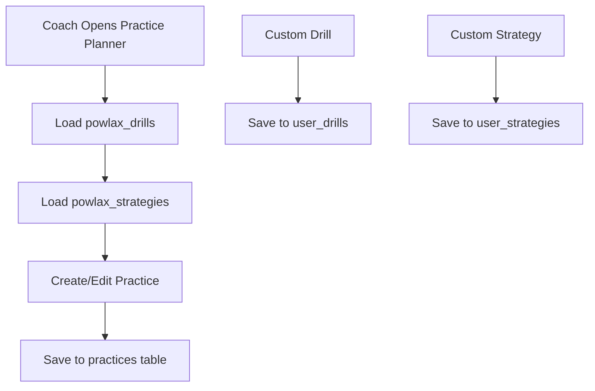
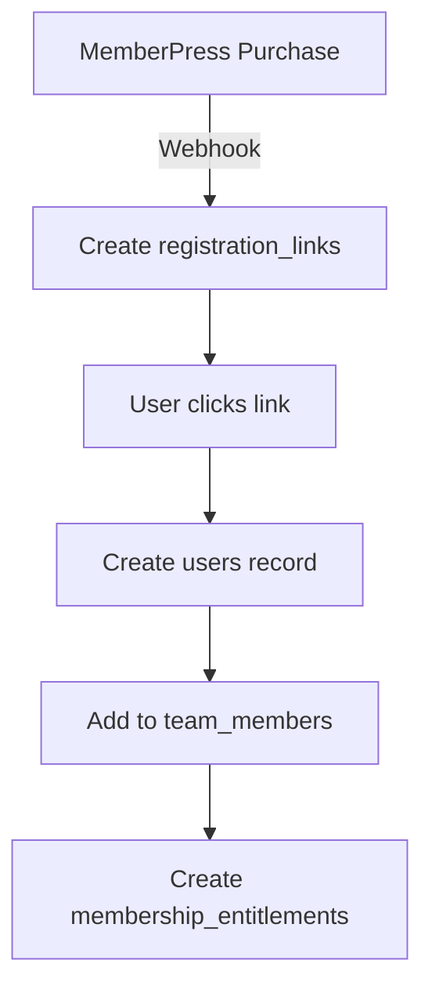

# POWLAX Production Data Architecture
**Version:** 3.0 - Production-Verified Tables  
**Date:** January 2025  
**Purpose:** Accurate mapping based on ACTUAL working tables in production

> ✅ **VERIFIED:** This document reflects the ACTUAL tables and columns in production, not theoretical or implied structures.

---

## Table of Contents
1. [Production Table Inventory](#1-production-table-inventory)
2. [Practice Planner Data Flow](#2-practice-planner-data-flow)
3. [Skills Academy Data Flow](#3-skills-academy-data-flow)
4. [User Registration & Authentication](#4-user-registration--authentication)
5. [Team Management Flow](#5-team-management-flow)
6. [Component-to-Table Mapping](#6-component-to-table-mapping)
7. [Critical Integration Points](#7-critical-integration-points)

---

## 1. Production Table Inventory

### 1.1 ✅ WORKING Tables (With Data)

| Table | Records | Purpose | Status |
|-------|---------|---------|---------|
| **users** | 12 | User accounts from WordPress | ✅ Active |
| **team_teams** | 10 | Team entities | ✅ Active |
| **team_members** | 10 | User-team associations | ✅ Active |
| **club_organizations** | 2 | Club/organization entities | ✅ Active |
| **practices** | 25 | Saved practice plans | ✅ Active |
| **powlax_drills** | 135 | Main drill library | ✅ Active |
| **powlax_strategies** | 29 | Strategy library | ✅ Active |
| **skills_academy_series** | 49 | Workout series | ✅ Active |
| **skills_academy_workouts** | 166 | Individual workouts | ✅ Active |
| **skills_academy_drills** | 167 | Academy drill videos | ✅ Active |
| **membership_products** | 12 | MemberPress mappings | ✅ Active |
| **membership_entitlements** | 7 | Active subscriptions | ✅ Active |
| **registration_links** | 10 | Invite tokens | ✅ Active |

### 1.2 📋 PREPARED Tables (Structure Only, No Data)

| Table | Purpose | Status |
|-------|---------|---------|
| **user_drills** | Custom coach drills | 📋 Ready, empty |
| **user_strategies** | Custom team plays | 📋 Ready, empty |
| **user_sessions** | Session tracking | 📋 Ready, empty |
| **user_activity_log** | Audit trail | 📋 Ready, empty |
| **user_subscriptions** | WordPress sync | 📋 Ready, empty |
| **webhook_queue** | Webhook processing | 📋 Ready, empty |
| **webhook_events** | Event logging | 📋 Ready, empty |

### 1.3 ❌ Tables That DON'T EXIST (Incorrect Assumptions)

- ~~`drills`~~ → Actually `powlax_drills`
- ~~`strategies`~~ → Actually `powlax_strategies`
- ~~`practice_plans`~~ → Actually `practices`
- ~~`registration_sessions`~~ → Doesn't exist
- ~~`user_onboarding`~~ → Doesn't exist
- ~~`user_profiles`~~ → Doesn't exist (data in `users`)

---

## 2. Practice Planner Data Flow

### 2.1 CORRECT Table Structure

#### `practices` Table (25 records) ✅
```sql
{
  id: UUID,
  wp_post_id: INTEGER,        -- WordPress post ID
  coach_id: UUID,              -- users.id of coach
  team_id: UUID,               -- team_teams.id
  name: TEXT,
  practice_date: DATE,
  start_time: TIME,
  duration_minutes: INTEGER,
  field_location: TEXT,
  goals: TEXT,
  notes: TEXT,
  raw_wp_data: JSONB,          -- Original WordPress data
  created_at, updated_at
}
```

#### `powlax_drills` Table (135 records) ✅
```sql
{
  id: UUID,
  wp_post_id: INTEGER,
  title: TEXT,
  content: TEXT,
  category: TEXT,
  duration_minutes: INTEGER,
  difficulty_level: TEXT,
  equipment: TEXT[],
  space_needed: TEXT,
  min_players: INTEGER,
  max_players: INTEGER,
  video_url: TEXT,
  lacrosse_lab_urls: TEXT[],
  lacrosse_lab_embeds: TEXT[],
  game_states: TEXT[],
  tags: TEXT[],
  status: TEXT,
  created_at, updated_at
}
```

#### `powlax_strategies` Table (29 records) ✅
```sql
{
  id: UUID,
  strategy_id: INTEGER,
  reference_id: TEXT,
  strategy_categories: TEXT[],
  strategy_name: TEXT,
  description: TEXT,
  lacrosse_lab_links: TEXT[],
  embed_codes: TEXT[],
  see_it_ages: TEXT[],         -- Age-appropriate viewing
  coach_it_ages: TEXT[],       -- Age-appropriate coaching
  own_it_ages: TEXT[],         -- Age-appropriate mastery
  vimeo_id: TEXT,
  vimeo_link: TEXT,
  pdf_shortcode: TEXT,
  master_pdf_url: TEXT,
  thumbnail_urls: TEXT[],
  created_at, updated_at
}
```

### 2.2 Practice Planning Flow



**Creating a Practice:**
```sql
-- Save practice plan
INSERT INTO practices (
  coach_id, team_id, name, practice_date,
  start_time, duration_minutes, field_location,
  goals, notes
) VALUES (?, ?, ?, ?, ?, ?, ?, ?, ?)

-- Link drills (stored in practices.raw_wp_data or notes)
-- No separate junction table - drills referenced in practice data
```

---

## 3. Skills Academy Data Flow

### 3.1 CORRECT Table Structure

#### `skills_academy_series` Table (49 records) ✅
```sql
{
  id: INTEGER,
  series_name: TEXT,
  series_slug: TEXT,
  series_type: TEXT,
  series_code: TEXT,
  description: TEXT,
  skill_focus: TEXT[],
  position_focus: TEXT[],
  difficulty_level: TEXT,
  color_scheme: JSONB,
  display_order: INTEGER,
  is_featured: BOOLEAN,
  is_active: BOOLEAN,
  is_premium: BOOLEAN
}
```

#### `skills_academy_workouts` Table (166 records) ✅
```sql
{
  id: INTEGER,
  series_id: INTEGER,           -- Links to series
  workout_name: TEXT,
  workout_size: TEXT,
  drill_count: INTEGER,
  drill_ids: JSONB,            -- ⚠️ ARRAY OF DRILL IDs!
  description: TEXT,
  estimated_duration_minutes: INTEGER,
  is_active: BOOLEAN
}
```

#### `skills_academy_drills` Table (167 records) ✅
```sql
{
  id: INTEGER,
  original_id: TEXT,
  title: TEXT,
  vimeo_id: TEXT,
  video_url: TEXT,
  drill_category: TEXT,
  equipment_needed: TEXT[],
  age_progressions: JSONB,
  space_needed: TEXT,
  complexity: TEXT,
  sets_and_reps: TEXT,
  duration_minutes: INTEGER,
  point_values: JSONB,
  tags: TEXT[]
}
```

### 3.2 Workout Access Flow

```sql
-- 1. Get series
SELECT * FROM skills_academy_series 
WHERE is_active = true 
ORDER BY display_order

-- 2. Get workouts in series
SELECT * FROM skills_academy_workouts 
WHERE series_id = ? AND is_active = true

-- 3. Get drills for workout (using drill_ids JSON)
SELECT * FROM skills_academy_drills 
WHERE id = ANY(
  SELECT jsonb_array_elements_text(drill_ids)::int 
  FROM skills_academy_workouts 
  WHERE id = ?
)
```

---

## 4. User Registration & Authentication

### 4.1 User Table Structure

#### `users` Table (12 records) ✅
```sql
{
  id: UUID,
  wordpress_id: INTEGER,       -- wp_users.ID
  wp_user_id: INTEGER,         -- Legacy duplicate
  email: TEXT,
  display_name: TEXT,          -- Full name display
  role: TEXT,                  -- Single primary role
  roles: TEXT[],               -- WordPress roles array
  club_id: UUID,               -- Link to club_organizations
  auth_user_id: UUID,          -- Supabase Auth user
  metadata: JSONB
}
```

### 4.2 Registration Flow



**Registration Link Usage:**
```sql
-- Check valid link
SELECT * FROM registration_links 
WHERE token = ? 
  AND expires_at > NOW() 
  AND used_count < max_uses

-- Create user
INSERT INTO users (
  email, display_name, role, metadata
) VALUES (?, ?, ?, ?)

-- Add to team
INSERT INTO team_members (
  team_id, user_id, role, status
) VALUES (
  registration_link.target_id,
  new_user_id,
  registration_link.default_role,
  'active'
)

-- Update link usage
UPDATE registration_links 
SET used_count = used_count + 1
```

---

## 5. Team Management Flow

### 5.1 Team Structure Tables

#### `club_organizations` Table (2 records) ✅
```sql
{
  id: UUID,
  name: TEXT,
  created_at, updated_at
}
```

#### `team_teams` Table (10 records) ✅
```sql
{
  id: UUID,
  club_id: UUID,               -- Optional link to club
  name: TEXT,
  created_at, updated_at
}
```

#### `team_members` Table (10 records) ✅
```sql
{
  id: UUID,
  team_id: UUID,
  user_id: UUID,
  role: TEXT,                  -- head_coach/assistant_coach/player/parent
  status: TEXT,                -- active/inactive/pending
  created_at
}
```

### 5.2 Team Access Flow

```sql
-- Get user's teams
SELECT t.*, tm.role 
FROM team_teams t
JOIN team_members tm ON t.id = tm.team_id
WHERE tm.user_id = ? AND tm.status = 'active'

-- Get team roster
SELECT u.display_name, u.email, tm.role, tm.status
FROM users u
JOIN team_members tm ON u.id = tm.user_id
WHERE tm.team_id = ?
ORDER BY tm.role, u.display_name
```

---

## 6. Component-to-Table Mapping

### VERIFIED Component Dependencies

| Component | Primary Tables | Data Flow |
|-----------|---------------|-----------|
| **Practice Planner** | `powlax_drills`, `powlax_strategies`, `practices` | Load drills → Create practice → Save |
| **Skills Academy** | `skills_academy_series`, `skills_academy_workouts`, `skills_academy_drills` | Series → Workouts → Drills (via drill_ids) |
| **Team Dashboard** | `team_teams`, `team_members`, `users` | Team info → Member list → User details |
| **Registration** | `registration_links`, `users`, `team_members` | Token → Create user → Join team |
| **User Dashboard** | `users`, `team_members`, `membership_entitlements` | Profile → Teams → Access rights |

### Component Queries

#### Practice Planner Component
```typescript
// Get drills for selection
const drills = await supabase
  .from('powlax_drills')
  .select('*')
  .eq('status', 'active')

// Save practice
const practice = await supabase
  .from('practices')
  .insert({
    coach_id: userId,
    team_id: teamId,
    name: practiceName,
    // ... other fields
  })
```

#### Skills Academy Component
```typescript
// Get workout with drills
const workout = await supabase
  .from('skills_academy_workouts')
  .select('*')
  .eq('id', workoutId)
  .single()

// Get drills using drill_ids JSON
const drillIds = workout.drill_ids // JSON array
const drills = await supabase
  .from('skills_academy_drills')
  .select('*')
  .in('id', drillIds)
```

---

## 7. Critical Integration Points

### 7.1 WordPress Sync Points

**Data Flow:** WordPress → Supabase
- User data: `wp_users` → `users`
- Practice plans: `wp_posts` (practice CPT) → `practices`
- Drills: `wp_posts` (drill CPT) → `powlax_drills`
- Strategies: `wp_posts` (strategy CPT) → `powlax_strategies`

**Sync Fields:**
```sql
-- users table
wordpress_id = wp_users.ID
email = wp_users.user_email
display_name = wp_users.display_name

-- practices table
wp_post_id = wp_posts.ID (where post_type = 'practice')

-- powlax_drills table
wp_post_id = wp_posts.ID (where post_type = 'drill')
```

### 7.2 MemberPress Integration

**Webhook Flow:**
```
MemberPress Event → webhook_queue → Process → Update tables
```

**Product Mapping:**
```sql
-- membership_products defines the mapping
SELECT * FROM membership_products 
WHERE wp_membership_id = ? -- From MemberPress webhook

-- Creates entitlement
INSERT INTO membership_entitlements (
  user_id, 
  entitlement_key,  -- From membership_products
  status,           -- 'active'
  expires_at
)
```

### 7.3 Authentication Flow

**Current State:**
- `users.auth_user_id` - Links to Supabase Auth (when implemented)
- `user_sessions` - Table exists but not populated
- Magic link system partially implemented via `/api/auth/magic-link`

**Future Implementation:**
```sql
-- After Supabase Auth user creation
UPDATE users 
SET auth_user_id = ? 
WHERE id = ?

-- Track session
INSERT INTO user_sessions (
  user_id, auth_token, expires_at, ip_address
)
```

---

## Summary: Production Reality

### ✅ What's Actually Working:
1. **Practice Planner** - Using `powlax_drills`, `powlax_strategies`, `practices`
2. **Skills Academy** - Full content with series, workouts, drills
3. **Team Management** - Teams, members, organizations
4. **Registration** - Links, user creation, team joining
5. **Membership** - Product mapping, entitlements

### ⚠️ Important Corrections:
1. Practice planner uses `powlax_drills` NOT `drills`
2. Practices stored in `practices` NOT `practice_plans`
3. Skills Academy links drills via `drill_ids` JSON column
4. No separate practice_plan_segments or practice_plan_drills tables
5. User names in `display_name` only, not first/last separately

### 📋 Ready but Unused:
1. `user_drills` and `user_strategies` for custom content
2. `user_sessions` for session tracking
3. `webhook_queue` for reliable webhook processing
4. Gamification tables (all empty)

---

**Document Version:** 3.0 - Production Verified  
**Last Updated:** January 2025  
**Verification Method:** Direct database queries  
**Next Review:** When implementing custom drills/strategies or gamification