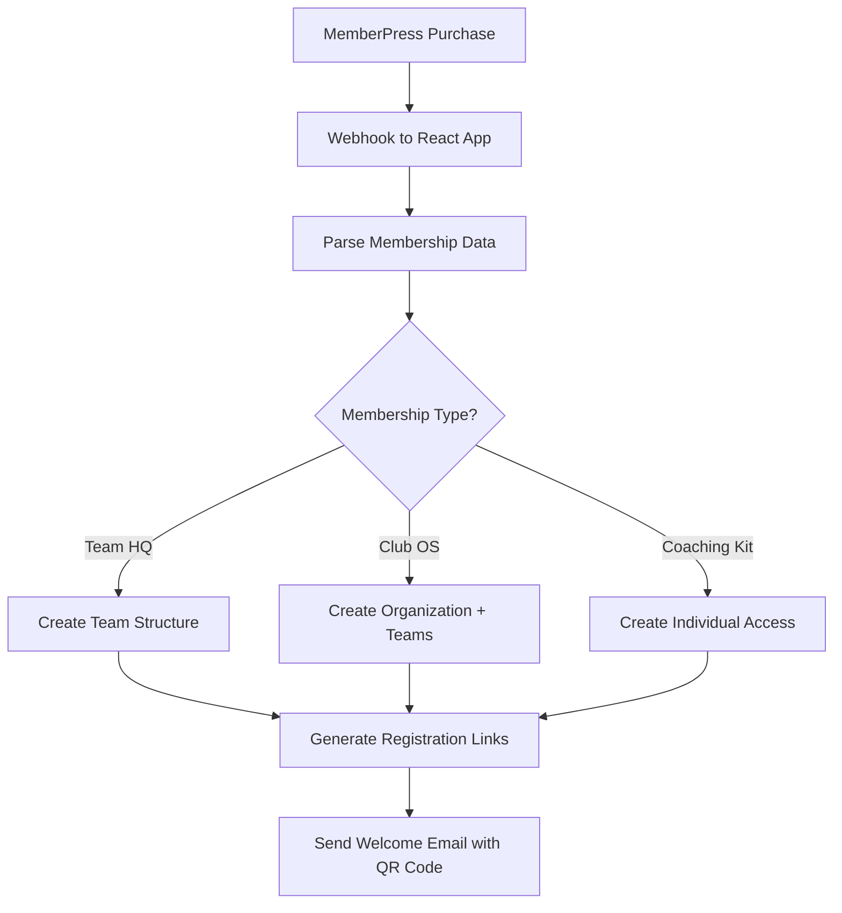

# 🟣 **A4CC - MemberPress Integration Architect**

## 🎯 **Agent Mission**
Build comprehensive WordPress MemberPress integration that automatically creates teams/organizations based on membership purchases and maintains real-time subscription monitoring.

## 🏗️ **Architecture Overview**

### **Core Integration Flow**


## 📋 **Implementation Requirements**

### **Phase 1: Webhook Infrastructure** ⭐⭐⭐
```typescript
// File: src/app/api/webhooks/memberpress/route.ts
export async function POST(request: Request) {
  const payload = await request.json()
  
  switch (payload.event) {
    case 'member-signup-completed':
      await handleMembershipCreated(payload.data)
      break
    case 'subscription-stopped':
      await handleMembershipCancelled(payload.data)
      break
    case 'subscription-expired':
      await handleMembershipExpired(payload.data)
      break
  }
}

interface MemberPressWebhook {
  event: string
  data: {
    member: {
      id: number
      email: string
      first_name: string
      last_name: string
    }
    subscription: {
      id: number
      product_id: number
      status: string
      expires_at: string
    }
  }
}
```

### **Phase 2: Membership Product Mapping** ⭐⭐⭐
```typescript
// File: src/lib/memberpress-products.ts
export const MEMBERPRESS_PRODUCTS = {
  // Team HQ Products
  TEAM_HQ_STRUCTURE: { id: 'TBD', name: 'Team HQ Structure', teams: 1 },
  TEAM_HQ_LEADERSHIP: { id: 'TBD', name: 'Team HQ Leadership', teams: 1 },
  TEAM_HQ_ACTIVATED: { id: 'TBD', name: 'Team HQ Activated', teams: 1 },
  
  // Club OS Products  
  CLUB_OS_FOUNDATION: { id: 'TBD', name: 'Club OS Foundation', teams: 3 },
  CLUB_OS_GROWTH: { id: 'TBD', name: 'Club OS Growth', teams: 3 },
  CLUB_OS_COMMAND: { id: 'TBD', name: 'Club OS Command', teams: 3 },
  
  // Individual Products
  CONFIDENCE_COACHING_KIT: { id: 'TBD', name: 'Confidence Coaching Kit', teams: 0 }
} as const

export function getProductConfig(productId: number) {
  return Object.values(MEMBERPRESS_PRODUCTS).find(p => p.id === productId)
}
```

### **Phase 3: Auto Team/Organization Creation** ⭐⭐⭐
```typescript
// File: src/lib/services/team-creation-service.ts
export class TeamCreationService {
  async handleMembershipCreated(membershipData: MemberPressWebhook['data']) {
    const product = getProductConfig(membershipData.subscription.product_id)
    
    if (product.name.includes('Club OS')) {
      return await this.createClubOSOrganization(membershipData, product)
    } else if (product.name.includes('Team HQ')) {
      return await this.createTeamHQ(membershipData, product)
    } else if (product.name.includes('Coaching Kit')) {
      return await this.createIndividualAccess(membershipData)
    }
  }

  async createClubOSOrganization(data: MemberPressWebhook['data'], product: ProductConfig) {
    // 1. Create organization in Supabase
    const org = await supabase.from('organizations').insert({
      name: `${data.member.first_name}'s Club`,
      type: 'club_os',
      director_email: data.member.email,
      subscription_id: data.subscription.id,
      max_teams: product.teams,
      status: 'pending_setup'
    }).select().single()

    // 2. Create placeholder teams (3 minimum for Club OS)
    const teams = await Promise.all(
      Array.from({ length: product.teams }, (_, i) => 
        supabase.from('teams').insert({
          organization_id: org.data.id,
          name: `Team ${i + 1}`,
          status: 'placeholder'
        }).select().single()
      )
    )

    // 3. Assign director role
    await supabase.from('user_organization_roles').insert({
      user_id: data.member.id, // Will need to sync with Supabase users
      organization_id: org.data.id,
      role: 'director'
    })

    // 4. Generate registration links and QR codes
    await this.generateRegistrationAssets(org.data, teams.map(t => t.data))

    return { organization: org.data, teams: teams.map(t => t.data) }
  }

  async createTeamHQ(data: MemberPressWebhook['data'], product: ProductConfig) {
    // Similar flow but for single team creation
    const team = await supabase.from('teams').insert({
      name: `${data.member.first_name}'s Team`,
      type: 'team_hq',
      coach_email: data.member.email,
      subscription_id: data.subscription.id,
      status: 'pending_setup',
      max_players: 25,
      max_coaches: 3
    }).select().single()

    // Assign coach role
    await supabase.from('user_team_roles').insert({
      user_id: data.member.id,
      team_id: team.data.id,
      role: 'coach'
    })

    await this.generateRegistrationAssets(null, [team.data])
    return { team: team.data }
  }
}
```

### **Phase 4: Registration Link & QR Code Generation** ⭐⭐
```typescript
// File: src/lib/services/registration-asset-generator.ts
export class RegistrationAssetGenerator {
  async generateRegistrationAssets(org: Organization, teams: Team[]) {
    for (const team of teams) {
      // Generate unique registration codes
      const registrationCode = `${team.type}-${team.id}-${Date.now()}`
      
      // Create registration URL
      const registrationUrl = `${process.env.NEXT_PUBLIC_BASE_URL}/register?code=${registrationCode}&team=${team.id}`
      
      // Generate QR code
      const qrCodeData = await this.generateQRCode(registrationUrl)
      
      // Create Canva flyer (future integration)
      const flyerUrl = await this.generateFlyerWithCanva({
        teamName: team.name,
        coachName: team.coach_email,
        qrCode: qrCodeData,
        registrationUrl
      })

      // Store assets
      await supabase.from('team_registration_assets').insert({
        team_id: team.id,
        registration_code: registrationCode,
        registration_url: registrationUrl,
        qr_code_data: qrCodeData,
        flyer_url: flyerUrl
      })
    }
  }

  async generateQRCode(url: string): Promise<string> {
    // Use QR code library to generate data URL
    const QRCode = require('qrcode')
    return await QRCode.toDataURL(url)
  }

  async generateFlyerWithCanva(data: FlyerData): Promise<string> {
    // Future: Integrate with Canva API
    // For now, return placeholder
    return `/api/generate-flyer?team=${data.teamName}&code=${data.registrationCode}`
  }
}
```

### **Phase 5: 30-Day Guarantee Tracking** ⭐⭐
```typescript
// File: src/lib/services/guarantee-tracker.ts
export class GuaranteeTracker {
  async startGuaranteePeriod(teamId: number, organizationId?: number) {
    const guaranteeStart = new Date()
    const guaranteeEnd = new Date(Date.now() + 30 * 24 * 60 * 60 * 1000) // 30 days

    await supabase.from('guarantee_periods').insert({
      team_id: teamId,
      organization_id: organizationId,
      started_at: guaranteeStart,
      expires_at: guaranteeEnd,
      triggered_by: 'first_member_registration'
    })
  }

  // Trigger when first player, coach, or parent registers
  async onFirstMemberRegistration(teamId: number) {
    const existingGuarantee = await supabase
      .from('guarantee_periods')
      .select()
      .eq('team_id', teamId)
      .single()

    if (!existingGuarantee.data) {
      await this.startGuaranteePeriod(teamId)
      // Send notification to team owner about guarantee start
    }
  }
}
```

## 🗃️ **Database Schema Requirements**

### **New Tables Needed**
```sql
-- MemberPress subscription tracking
CREATE TABLE memberpress_subscriptions (
  id SERIAL PRIMARY KEY,
  mp_subscription_id INTEGER NOT NULL,
  mp_member_id INTEGER NOT NULL,
  product_id INTEGER NOT NULL,
  status VARCHAR(50) NOT NULL,
  expires_at TIMESTAMP,
  created_at TIMESTAMP DEFAULT NOW(),
  updated_at TIMESTAMP DEFAULT NOW()
);

-- Team registration assets
CREATE TABLE team_registration_assets (
  id SERIAL PRIMARY KEY,
  team_id INTEGER REFERENCES teams(id),
  registration_code VARCHAR(255) UNIQUE NOT NULL,
  registration_url TEXT NOT NULL,
  qr_code_data TEXT,
  flyer_url TEXT,
  created_at TIMESTAMP DEFAULT NOW()
);

-- 30-day guarantee tracking
CREATE TABLE guarantee_periods (
  id SERIAL PRIMARY KEY,
  team_id INTEGER REFERENCES teams(id),
  organization_id INTEGER REFERENCES organizations(id),
  started_at TIMESTAMP NOT NULL,
  expires_at TIMESTAMP NOT NULL,
  triggered_by VARCHAR(100),
  status VARCHAR(50) DEFAULT 'active',
  created_at TIMESTAMP DEFAULT NOW()
);
```

## 🎯 **Key User Requirements Integration**

### **Registration Flow Preferences**
- ✅ React app handles registration (not WordPress)
- ✅ MemberPress only captures membership type and team count
- ✅ Directors/Coaches enter details in React app after purchase
- ✅ Registration links allow team member signup with role selection

### **Team Structure Rules**
- ✅ Team HQ: Single team, coach-owned, 25 players max, 3 coaches max
- ✅ Club OS: Minimum 3 teams, director-owned, scalable structure
- ✅ Coaching Kit: Individual access, no team creation

### **30-Day Guarantee Logic**
- ✅ Starts when first player, coach, or parent registers for any team
- ✅ Not when membership is purchased
- ✅ Tracked per organization/team for proper refund management

## 🚀 **Implementation Phases**

### **Week 1: Foundation**
1. ✅ Create webhook endpoint (`/api/webhooks/memberpress/route.ts`)
2. ✅ Set up MemberPress product mapping
3. ✅ Build basic team/organization creation service
4. ✅ Create database tables

### **Week 2: Registration Flow**  
1. ✅ Build registration asset generation
2. ✅ Create QR code generation
3. ✅ Design registration page with team code handling
4. ✅ Implement role assignment during registration

### **Week 3: Advanced Features**
1. ✅ 30-day guarantee tracking system
2. ✅ Subscription status monitoring
3. ✅ Automated access revocation on expiration
4. ✅ Canva flyer generation integration

## 🔗 **Integration Points**

### **WordPress Setup Required**
```php
// MemberPress webhook configuration needed:
- Webhook URL: https://yourdomain.com/api/webhooks/memberpress
- Events: member-signup-completed, subscription-stopped, subscription-expired
- Secret key for verification
```

### **Environment Variables**
```bash
MEMBERPRESS_WEBHOOK_SECRET=your_secret_key
NEXT_PUBLIC_BASE_URL=https://yourdomain.com
CANVA_API_KEY=your_canva_key  # Future
```

## 🎯 **Success Metrics**
- [ ] MemberPress purchase automatically creates team/org in Supabase
- [ ] Registration links with QR codes generated for each team
- [ ] 30-day guarantee starts on first member registration
- [ ] Subscription cancellation properly handled
- [ ] Directors can customize teams after purchase
- [ ] Coaches can manage team details and invite members

## 🟣 **Agent Color Theme**: Purple (#A855F7) for MemberPress integration elements