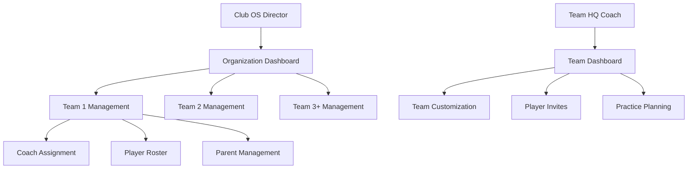

# 🟠 **A4CC - Team HQ & Club OS Management Architect**

## 🎯 **Agent Mission**
Build comprehensive team and organization management interfaces that allow Directors and Coaches to customize, manage, and scale their Team HQ and Club OS structures after MemberPress purchase.

## 🏗️ **Architecture Overview**

### **Management Hierarchy**


## 📋 **Implementation Requirements**

### **Phase 1: Organization Management Dashboard** ⭐⭐⭐
```typescript
// File: src/app/(authenticated)/organizations/[orgId]/dashboard/page.tsx
export default function OrganizationDashboard({ params }: { params: { orgId: string } }) {
  const { organization, teams, userRole } = useOrganization(params.orgId)
  
  if (userRole !== 'director') {
    return <UnauthorizedAccess />
  }

  return (
    <div className="organization-dashboard">
      <OrganizationHeader organization={organization} />
      <QuickStats teams={teams} />
      <TeamsGrid teams={teams} onManageTeam={handleTeamManagement} />
      <AddTeamSection organization={organization} />
    </div>
  )
}

interface OrganizationDashboard {
  organization: Organization
  teams: Team[]
  totalPlayers: number
  totalCoaches: number
  activeSubscription: MemberPressSubscription
  guaranteeStatus: GuaranteeStatus
}
```

### **Phase 2: Team Customization Interface** ⭐⭐⭐
```typescript
// File: src/components/team-management/TeamSetupWizard.tsx
export function TeamSetupWizard({ team, organizationId }: TeamSetupProps) {
  const [setupStep, setSetupStep] = useState(1)
  const [teamData, setTeamData] = useState<TeamSetupData>({
    name: team.name,
    ageGroup: '',
    level: '', // Recreational, Competitive, Elite
    season: '',
    maxPlayers: 25,
    maxCoaches: 3,
    logo: null,
    colors: { primary: '#000000', secondary: '#ffffff' }
  })

  const steps = [
    { id: 1, title: 'Basic Info', component: <BasicInfoStep /> },
    { id: 2, title: 'Team Details', component: <TeamDetailsStep /> },
    { id: 3, title: 'Branding', component: <BrandingStep /> },
    { id: 4, title: 'Invitations', component: <InvitationSetup /> }
  ]

  return (
    <div className="team-setup-wizard">
      <ProgressIndicator currentStep={setupStep} totalSteps={steps.length} />
      <StepContent step={steps.find(s => s.id === setupStep)} />
      <NavigationButtons 
        onNext={() => setSetupStep(s => s + 1)}
        onPrevious={() => setSetupStep(s => s - 1)}
        onComplete={handleTeamSetupComplete}
      />
    </div>
  )
}

interface TeamSetupData {
  name: string
  ageGroup: string // U8, U10, U12, U14, U16, U18, Adult
  level: 'recreational' | 'competitive' | 'elite'
  season: string // Spring 2024, Fall 2024, etc.
  maxPlayers: number
  maxCoaches: number
  logo?: File
  colors: {
    primary: string
    secondary: string
  }
  location?: {
    city: string
    state: string
    practice_location?: string
  }
}
```

### **Phase 3: Member Invitation System** ⭐⭐⭐
```typescript
// File: src/components/team-management/MemberInvitations.tsx
export function MemberInvitations({ team }: { team: Team }) {
  const [invitationType, setInvitationType] = useState<'individual' | 'bulk'>('individual')
  const [invitations, setInvitations] = useState<PendingInvitation[]>([])

  return (
    <div className="member-invitations">
      <InvitationHeader team={team} />
      
      <div className="invitation-methods">
        <TabGroup>
          <Tab active={invitationType === 'individual'} onClick={() => setInvitationType('individual')}>
            Individual Invites
          </Tab>
          <Tab active={invitationType === 'bulk'} onClick={() => setInvitationType('bulk')}>
            Bulk Invites
          </Tab>
        </TabGroup>
        
        {invitationType === 'individual' && (
          <IndividualInviteForm onInvite={handleIndividualInvite} />
        )}
        
        {invitationType === 'bulk' && (
          <BulkInviteInterface onBulkInvite={handleBulkInvite} />
        )}
      </div>

      <RegistrationQRCode team={team} />
      <DownloadableFlyer team={team} />
      <PendingInvitationsList invitations={invitations} />
    </div>
  )
}

interface PendingInvitation {
  id: string
  email: string
  role: 'player' | 'coach' | 'parent'
  status: 'pending' | 'accepted' | 'expired'
  sentAt: Date
  expiresAt: Date
  registrationCode: string
}

// Individual invite form
function IndividualInviteForm({ onInvite }: { onInvite: (invite: InviteData) => void }) {
  const [formData, setFormData] = useState({
    email: '',
    firstName: '',
    lastName: '',
    role: 'player' as const,
    personalMessage: ''
  })

  return (
    <form onSubmit={handleSubmit} className="invite-form">
      <div className="form-grid">
        <input 
          type="email" 
          placeholder="Email address"
          value={formData.email}
          onChange={e => setFormData({...formData, email: e.target.value})}
          required
        />
        <input 
          type="text" 
          placeholder="First name"
          value={formData.firstName}
          onChange={e => setFormData({...formData, firstName: e.target.value})}
          required
        />
        <input 
          type="text" 
          placeholder="Last name"
          value={formData.lastName}
          onChange={e => setFormData({...formData, lastName: e.target.value})}
          required
        />
        <select 
          value={formData.role}
          onChange={e => setFormData({...formData, role: e.target.value as any})}
        >
          <option value="player">Player</option>
          <option value="coach">Coach</option>
          <option value="parent">Parent</option>
        </select>
      </div>
      
      <textarea 
        placeholder="Personal message (optional)"
        value={formData.personalMessage}
        onChange={e => setFormData({...formData, personalMessage: e.target.value})}
      />
      
      <button type="submit" className="send-invite-btn">
        Send Invitation
      </button>
    </form>
  )
}
```

### **Phase 4: Team Scaling & Organization Growth** ⭐⭐
```typescript
// File: src/components/organization-management/TeamScaling.tsx
export function TeamScaling({ organization }: { organization: Organization }) {
  const { teams, subscription } = useOrganizationDetails(organization.id)
  const availableSlots = subscription.maxTeams - teams.length

  return (
    <div className="team-scaling">
      <ScalingOverview 
        currentTeams={teams.length}
        maxTeams={subscription.maxTeams}
        subscriptionType={subscription.type}
      />
      
      {availableSlots > 0 && (
        <AddTeamSection 
          availableSlots={availableSlots}
          onAddTeam={handleAddNewTeam}
        />
      )}
      
      {availableSlots === 0 && (
        <UpgradePrompt 
          currentPlan={subscription.type}
          onUpgrade={handlePlanUpgrade}
        />
      )}
      
      <TeamList teams={teams} onManage={handleTeamManagement} />
    </div>
  )
}

// Handle adding new teams to existing organizations
async function handleAddNewTeam(organizationId: number, teamData: NewTeamData) {
  // Check available slots
  const { subscription, teams } = await getOrganizationLimits(organizationId)
  
  if (teams.length >= subscription.maxTeams) {
    throw new Error('Team limit reached. Please upgrade your plan.')
  }

  // Create new team
  const newTeam = await supabase.from('teams').insert({
    organization_id: organizationId,
    name: teamData.name,
    age_group: teamData.ageGroup,
    level: teamData.level,
    status: 'active',
    max_players: 25,
    max_coaches: 3
  }).select().single()

  // Generate registration assets
  await generateTeamRegistrationAssets(newTeam.data.id)
  
  return newTeam.data
}
```

### **Phase 5: Team HQ to Club OS Upgrade Flow** ⭐⭐
```typescript
// File: src/components/upgrades/TeamHQToClubOSUpgrade.tsx
export function TeamHQToClubOSUpgrade({ team }: { team: Team }) {
  const [upgradeData, setUpgradeData] = useState({
    additionalTeams: 2, // Minimum to reach 3 total
    organizationName: `${team.name} Club`,
    keepExistingTeam: true
  })

  return (
    <div className="upgrade-flow">
      <UpgradeHeader 
        currentPlan="Team HQ"
        targetPlan="Club OS"
        benefits={['Manage multiple teams', 'Organization-wide leaderboards', 'Director dashboard']}
      />
      
      <UpgradeConfiguration
        existingTeam={team}
        upgradeData={upgradeData}
        onChange={setUpgradeData}
      />
      
      <PricingComparison 
        currentCost={getCurrentSubscriptionCost(team.id)}
        newCost={getClubOSCost(upgradeData.additionalTeams)}
        savings={getUpgradeSavings()}
      />
      
      <button 
        onClick={() => handleUpgradeToClubOS(team, upgradeData)}
        className="upgrade-button"
      >
        Upgrade to Club OS
      </button>
    </div>
  )
}

async function handleUpgradeToClubOS(team: Team, upgradeData: UpgradeData) {
  // 1. Create organization structure
  const organization = await supabase.from('organizations').insert({
    name: upgradeData.organizationName,
    type: 'club_os',
    created_from_upgrade: team.id,
    director_id: team.coach_id // Current coach becomes director
  }).select().single()

  // 2. Move existing team to organization
  await supabase.from('teams').update({
    organization_id: organization.data.id
  }).eq('id', team.id)

  // 3. Create additional placeholder teams
  const newTeams = await Promise.all(
    Array.from({ length: upgradeData.additionalTeams }, (_, i) =>
      supabase.from('teams').insert({
        organization_id: organization.data.id,
        name: `Team ${i + 2}`, // Team 1 is the existing team
        status: 'placeholder'
      }).select().single()
    )
  )

  // 4. Update user role from coach to director
  await updateUserRole(team.coach_id, organization.data.id, 'director')

  // 5. Initiate MemberPress subscription change
  await initiateMemberPressUpgrade(team.subscription_id, 'club_os_growth')

  return { organization: organization.data, newTeams }
}
```

## 🎨 **Dashboard Interface Requirements**

### **Director Dashboard Layout**
```typescript
// Organization-level dashboard for Club OS directors
<OrganizationDashboard>
  <Header>
    <OrganizationName />
    <QuickActions />
    <NotificationCenter />
  </Header>
  
  <StatsOverview>
    <Stat label="Total Teams" value={teams.length} />
    <Stat label="Total Players" value={totalPlayers} />
    <Stat label="Active Coaches" value={activeCoaches} />
    <Stat label="Guarantee Period" value={guaranteeDaysLeft} />
  </StatsOverview>
  
  <TeamsGrid>
    {teams.map(team => (
      <TeamCard 
        key={team.id}
        team={team}
        stats={getTeamStats(team.id)}
        onManage={() => navigateToTeamManagement(team.id)}
      />
    ))}
    <AddTeamCard onClick={handleAddNewTeam} />
  </TeamsGrid>
  
  <RecentActivity />
</OrganizationDashboard>
```

### **Coach Dashboard Layout**
```typescript
// Team-level dashboard for Team HQ coaches
<TeamDashboard>
  <Header>
    <TeamName />
    <TeamStats />
    <QuickActions />
  </Header>
  
  <ManagementTabs>
    <Tab label="Roster" component={<RosterManagement />} />
    <Tab label="Practice Plans" component={<PracticePlanning />} />
    <Tab label="Skills Academy" component={<AcademyOverview />} />
    <Tab label="Invitations" component={<MemberInvitations />} />
    <Tab label="Settings" component={<TeamSettings />} />
  </ManagementTabs>
</TeamDashboard>
```

## 🗃️ **Database Schema Updates**

### **Enhanced Team Management**
```sql
-- Add team branding and customization
ALTER TABLE teams ADD COLUMN logo_url TEXT;
ALTER TABLE teams ADD COLUMN primary_color VARCHAR(7) DEFAULT '#000000';
ALTER TABLE teams ADD COLUMN secondary_color VARCHAR(7) DEFAULT '#ffffff';
ALTER TABLE teams ADD COLUMN practice_location TEXT;
ALTER TABLE teams ADD COLUMN season VARCHAR(50);
ALTER TABLE teams ADD COLUMN level VARCHAR(20);

-- Team invitation tracking
CREATE TABLE team_invitations (
  id SERIAL PRIMARY KEY,
  team_id INTEGER REFERENCES teams(id),
  organization_id INTEGER REFERENCES organizations(id),
  email VARCHAR(255) NOT NULL,
  first_name VARCHAR(100),
  last_name VARCHAR(100),
  role VARCHAR(20) NOT NULL,
  status VARCHAR(20) DEFAULT 'pending',
  invitation_code VARCHAR(255) UNIQUE NOT NULL,
  expires_at TIMESTAMP NOT NULL,
  sent_at TIMESTAMP DEFAULT NOW(),
  accepted_at TIMESTAMP,
  personal_message TEXT,
  created_by INTEGER REFERENCES users(id)
);

-- Upgrade tracking for Team HQ -> Club OS transitions
CREATE TABLE upgrade_history (
  id SERIAL PRIMARY KEY,
  original_team_id INTEGER REFERENCES teams(id),
  new_organization_id INTEGER REFERENCES organizations(id),
  upgrade_type VARCHAR(50) NOT NULL,
  original_subscription_id INTEGER,
  new_subscription_id INTEGER,
  upgraded_at TIMESTAMP DEFAULT NOW(),
  upgraded_by INTEGER REFERENCES users(id)
);
```

## 🎯 **User Experience Flows**

### **Director Experience (Club OS)**
1. **Post-Purchase Setup**
   - Welcome email with setup link
   - Organization customization wizard
   - Team placeholder setup (3 minimum)
   - Registration asset generation

2. **Daily Management**
   - Overview dashboard with all team stats
   - Individual team management
   - Cross-team competitions setup
   - Director-only features access

3. **Growth & Scaling**
   - Add additional teams within subscription limits
   - Upgrade subscription for more teams
   - Organization-wide analytics and reporting

### **Coach Experience (Team HQ)**
1. **Post-Purchase Setup**
   - Welcome email with team setup link
   - Team customization wizard
   - Player/parent invitation setup
   - Registration QR code generation

2. **Daily Management**
   - Team-focused dashboard
   - Practice planning tools
   - Skills Academy monitoring
   - Parent-player communication

3. **Growth Options**
   - Upgrade to Club OS (3+ teams)
   - Add additional coaching staff
   - Advanced team management features

## 🚀 **Implementation Timeline**

### **Week 1: Core Infrastructure**
1. ✅ Organization and team management pages
2. ✅ Basic dashboard layouts
3. ✅ Database schema updates
4. ✅ Navigation structure

### **Week 2: Customization & Invitations**
1. ✅ Team setup wizard
2. ✅ Member invitation system
3. ✅ QR code and flyer generation
4. ✅ Registration flow completion

### **Week 3: Advanced Features**
1. ✅ Team scaling functionality
2. ✅ Upgrade flows (Team HQ → Club OS)
3. ✅ Cross-team management
4. ✅ Analytics and reporting

## 🔗 **Integration Requirements**

### **MemberPress Integration**
- Monitor subscription status changes
- Handle upgrade/downgrade flows
- Sync subscription limits with team counts

### **Registration System**
- Connect invitation codes to registration flow
- Handle role assignment during signup
- Track guarantee period triggers

### **Skills Academy Integration**  
- Organization-wide leaderboards
- Cross-team competitions
- Director analytics access

## 🎯 **Success Criteria**
- [ ] Directors can manage multiple teams from single dashboard
- [ ] Coaches can fully customize their teams post-purchase
- [ ] Member invitations work seamlessly with role assignment
- [ ] Team HQ can upgrade to Club OS without data loss
- [ ] QR codes and flyers generate automatically
- [ ] 30-day guarantee tracking works correctly
- [ ] Subscription limits are enforced properly

## 🟠 **Agent Color Theme**: Orange (#F97316) for team/organization management elements