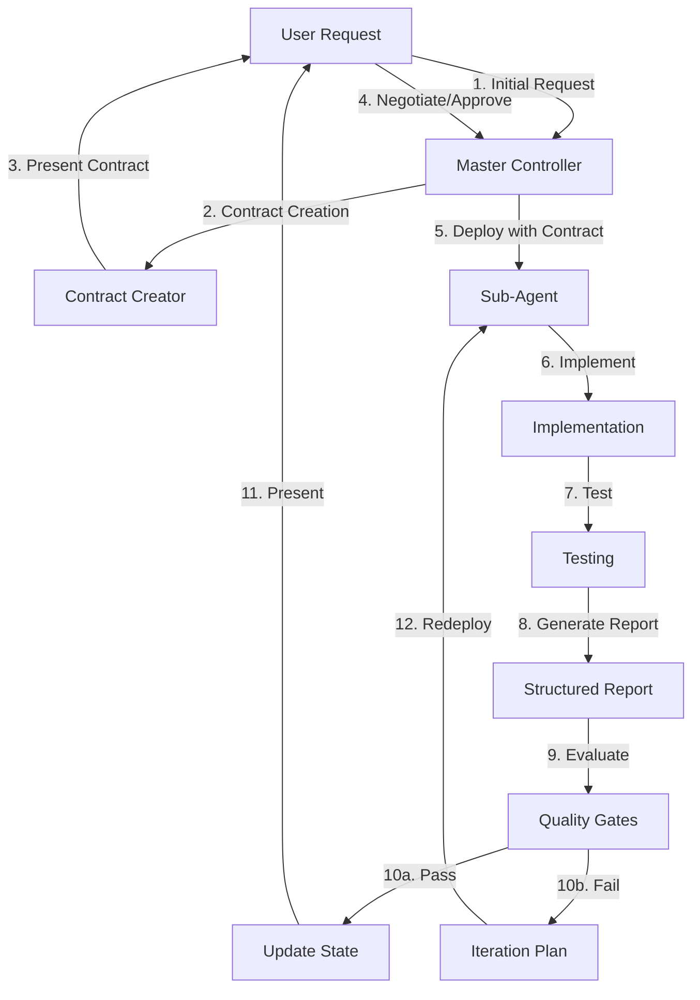

# 🎯 **Comprehensive Sub-Agent Workflow Improvement Plan**
## **Complete End-to-End Quality Control System with Contract-First Approach**

*Created: 2025-01-16*  
*Status: READY FOR IMPLEMENTATION*  
*Purpose: Transform sub-agent workflow into a reliable, testable, contract-based system with iterative quality loops*

---

## 📊 **CURRENT STATE ANALYSIS**

### **Critical Problems Identified**

1. **Response Format Chaos**
   - Sub-agents return unstructured text
   - No standardized success/failure indicators
   - Missing test results and quality metrics
   - Unclear completion status

2. **Contract Definition Gaps**
   - No formal contract structure
   - Success criteria undefined
   - Missing test requirements
   - No state tracking mechanism

3. **Quality Control Absence**
   - No automated testing in sub-agent responses
   - No iteration capability
   - No quality gates before user presentation
   - Manual re-prompting for same issues

4. **Missing Sub-Agent Capabilities**
   - No dedicated Testing Agent
   - No Quality Assurance Agent
   - No Documentation Agent
   - No Integration Specialist

5. **State Management Issues**
   - No contract fulfillment tracking
   - Component state changes not documented
   - Breaking changes not detected
   - No rollback mechanism

---

## 🏗️ **NEW WORKFLOW ARCHITECTURE**

### **Contract-First Development Cycle**



---

## 📝 **CONTRACT STRUCTURE DEFINITION**

### **Viable Contract Components**

```typescript
interface SubAgentContract {
  // Identification
  contractId: string;
  version: string;
  createdAt: Date;
  component: string; // Which part of app this affects
  
  // Intent Clarification (Contract-First Prompting)
  intent: {
    goal: string;
    scope: string[];
    outOfScope: string[];
    assumptions: string[];
    risks: string[];
  };
  
  // Deliverables
  deliverables: {
    code: {
      files: string[];
      functions: string[];
      components: string[];
    };
    tests: {
      unit: string[];
      integration: string[];
      e2e: string[];
    };
    documentation: {
      updates: string[];
      inline: boolean;
    };
  };
  
  // Success Criteria
  successCriteria: {
    functional: string[];    // "Modal opens when clicked"
    performance: string[];   // "Loads in < 3 seconds"
    quality: string[];      // "No console errors"
    testing: string[];      // "All Playwright tests pass"
  };
  
  // Quality Gates
  qualityGates: {
    buildMustPass: boolean;
    lintMaxErrors: number;
    testCoverage: number;
    mobileResponsive: boolean;
    performanceTarget: number;
  };
  
  // State Management
  state: {
    currentState: string;    // Description of current functionality
    targetState: string;     // Description of desired functionality
    breakingChanges: string[]; // What might break
    dependencies: string[];   // What depends on this
  };
  
  // Response Format
  responseFormat: {
    structure: 'JSON' | 'MARKDOWN';
    requiredSections: string[];
    testResultFormat: string;
  };
}
```

### **Contract Negotiation Protocol**

```markdown
## CONTRACT NEGOTIATION PHASES

### Phase 1: Intent Discovery (Contract-First)
Master Controller: "I need to understand your intent completely. Let me ask clarifying questions:"
1. What specific problem are you solving?
2. Who will use this feature? (coach/player/parent)
3. What's the current behavior vs desired behavior?
4. What are the success indicators?
5. What edge cases concern you?

### Phase 2: Contract Draft
Master Controller: "Based on our discussion, here's the contract:"
[Present structured contract as above]

### Phase 3: User Review
User: Reviews and requests modifications
Master Controller: Updates contract based on feedback

### Phase 4: Contract Lock
User: "Approved"
Master Controller: Contract becomes immutable for this task

### Phase 5: Execution
Sub-agents work against locked contract
All evaluation based on contract criteria
```

---

## 🎭 **STANDARDIZED SUB-AGENT RESPONSE FORMAT**

### **Required Response Structure**

```json
{
  "contractId": "contract-123",
  "agentType": "powlax-frontend-developer",
  "timestamp": "2025-01-16T10:30:00Z",
  
  "implementation": {
    "filesCreated": ["file1.tsx", "file2.tsx"],
    "filesModified": ["file3.tsx"],
    "functionsAdded": ["handleModal", "validateInput"],
    "componentsCreated": ["ModalComponent"]
  },
  
  "testing": {
    "testsWritten": ["modal.spec.ts"],
    "testResults": {
      "passed": 8,
      "failed": 2,
      "skipped": 0,
      "failures": [
        {
          "test": "Modal opens on mobile",
          "error": "Touch target too small",
          "screenshot": "test-failure-1.png"
        }
      ]
    },
    "buildStatus": "PASS",
    "lintErrors": 0,
    "typeErrors": 0
  },
  
  "qualityMetrics": {
    "score": 85,
    "breakdown": {
      "functionality": 90,
      "performance": 85,
      "testing": 80,
      "documentation": 85
    }
  },
  
  "stateChanges": {
    "before": "Modal button exists but non-functional",
    "after": "Modal opens with video content from database",
    "breakingChanges": [],
    "newDependencies": ["vimeo-player"]
  },
  
  "issues": [
    {
      "severity": "minor",
      "description": "Mobile layout needs adjustment",
      "recommendation": "Increase touch target to 44px"
    }
  ],
  
  "nextSteps": {
    "required": ["Fix mobile touch targets"],
    "recommended": ["Add loading state", "Implement error boundary"]
  },
  
  "completionStatus": "PARTIAL",
  "completionPercentage": 85,
  "readyForUser": false
}
```

---

## 🤖 **NEW SUB-AGENTS NEEDED**

### **1. Testing Specialist Agent (powlax-test-specialist)**
```yaml
Purpose: Write and execute comprehensive tests
Capabilities:
  - Write Playwright E2E tests
  - Create unit tests with Jest
  - Generate integration tests
  - Mobile viewport testing
  - Performance testing
  - Screenshot capture on failures
Tools: Bash, Write, Read, Grep
Outputs: Test files, results JSON, coverage reports
```

### **2. Quality Assurance Agent (powlax-qa-specialist)**
```yaml
Purpose: Validate all work against contracts
Capabilities:
  - Run quality gate checks
  - Evaluate against success criteria
  - Generate quality scores
  - Identify breaking changes
  - Regression testing
Tools: Bash, Read, Grep
Outputs: Quality reports, pass/fail decisions
```

### **3. Documentation Agent (powlax-doc-specialist)**
```yaml
Purpose: Maintain accurate documentation
Capabilities:
  - Update component documentation
  - Generate API documentation
  - Create user guides
  - Maintain state documentation
  - Update contracts
Tools: Write, Read, MultiEdit
Outputs: Updated docs, state files
```

### **4. Integration Specialist (powlax-integration-specialist)**
```yaml
Purpose: Ensure components work together
Capabilities:
  - Test component interactions
  - Validate data flow
  - Check API integrations
  - Test authentication flow
  - Verify database connections
Tools: Bash, Read, Grep
Outputs: Integration test results
```

---

## 📊 **STATE TRACKING SYSTEM**

### **Component State Files**

Each component gets a state file tracking its current status:

```yaml
# /state/practice-planner.state.yaml
component: PracticePlanner
version: 1.2.3
lastModified: 2025-01-16
status: FUNCTIONAL | PARTIAL | BROKEN

functionality:
  drillLibrary:
    status: FUNCTIONAL
    dataSource: team_drills
    lastTested: 2025-01-16
    issues: []
    
  modals:
    video:
      status: BROKEN
      issue: "Not opening on click"
      contract: "contract-video-modal-fix"
      
  timeline:
    status: FUNCTIONAL
    features:
      - dragDrop: working
      - parallelDrills: working
      - timeCalculation: working

dependencies:
  - supabase: 2.39.0
  - shadcn-ui: latest
  - framer-motion: 10.x

contracts:
  active:
    - id: contract-modal-fix
      status: IN_PROGRESS
      agent: powlax-frontend-developer
      
  completed:
    - id: contract-drill-integration
      completedAt: 2025-01-15
      result: SUCCESS
```

### **Contract Fulfillment Tracking**

```yaml
# /contracts/active/contract-modal-fix.yaml
contractId: contract-modal-fix
status: IN_PROGRESS
iterations: 2

iteration1:
  timestamp: 2025-01-16T09:00:00Z
  agent: powlax-frontend-developer
  result: FAILED
  issues:
    - "Build failed: JSX syntax error"
    - "Test coverage: 60% (required 80%)"
  
iteration2:
  timestamp: 2025-01-16T10:00:00Z
  agent: powlax-frontend-developer
  result: IN_PROGRESS
  fixes:
    - "Fixed JSX syntax"
    - "Added missing tests"
```

---

## 🔄 **ITERATION LOOP PROTOCOL**

### **Automatic Iteration Triggers**

```typescript
class IterationManager {
  shouldIterate(response: AgentResponse): boolean {
    return (
      response.testResults.failed > 0 ||
      response.qualityMetrics.score < 80 ||
      response.completionStatus !== 'COMPLETE' ||
      !response.readyForUser
    );
  }
  
  createIterationPlan(response: AgentResponse): IterationPlan {
    return {
      contractId: response.contractId,
      iterationNumber: response.iteration + 1,
      focusAreas: this.identifyFocusAreas(response),
      specificFixes: this.generateFixes(response.issues),
      testRequirements: this.enhanceTests(response.testResults),
      successCriteria: this.adjustCriteria(response)
    };
  }
}
```

---

## 🚀 **IMPLEMENTATION PHASES**

### **Phase 1: Contract System (Days 1-2)**
```markdown
1. Create contract templates for common tasks
2. Implement contract negotiation protocol
3. Build contract validation system
4. Create contract storage structure
```

### **Phase 2: Response Standardization (Days 3-4)**
```markdown
1. Update all sub-agent response formats
2. Create response parsing utilities
3. Implement quality scoring algorithm
4. Build test result aggregation
```

### **Phase 3: New Agents (Days 5-7)**
```markdown
1. Create Testing Specialist agent
2. Create QA Specialist agent
3. Create Documentation agent
4. Create Integration Specialist
5. Test agent coordination
```

### **Phase 4: State Management (Days 8-9)**
```markdown
1. Create state file structure
2. Implement state tracking system
3. Build breaking change detection
4. Create rollback mechanism
```

### **Phase 5: Quality Gates (Days 10-11)**
```markdown
1. Implement automated quality gates
2. Create iteration decision logic
3. Build refinement plan generator
4. Test complete loop system
```

### **Phase 6: Practice Planner Test (Days 12-14)**
```markdown
1. Apply to all Practice Planner modals
2. Fix database integration issues
3. Validate mobile responsiveness
4. Achieve 100% test coverage
```

### **Phase 7: Skills Academy Test (Days 15-17)**
```markdown
1. Apply to quiz-style interface
2. Implement point system
3. Test workout flow
4. Validate data persistence
```

---

## ✅ **SUCCESS METRICS**

### **Immediate (30 Days)**
- Contract completion rate: >90%
- First-pass success: >70%
- Average iterations: <2
- User re-prompts: <10%
- Build success: 100%

### **Long-term (90 Days)**
- Quality score average: >85
- Test coverage: >90%
- Mobile success rate: 100%
- State accuracy: 100%
- Documentation currency: 100%

---

## 🎯 **CRITICAL SUCCESS FACTORS**

### **What Makes a Contract Viable**

1. **Clear Intent** - Goal must be unambiguous
2. **Measurable Success** - Criteria must be testable
3. **Complete Scope** - All deliverables defined
4. **State Awareness** - Current vs target state clear
5. **Quality Standards** - Gates must be achievable
6. **Response Format** - Structure must be parseable

### **What Makes Iteration Successful**

1. **Specific Fixes** - Not "fix the modal" but "increase touch target to 44px"
2. **Test Focus** - Each iteration adds tests for previous failures
3. **Quality Improvement** - Score must increase each iteration
4. **Time Bound** - Max 3 iterations before escalation
5. **Learning Loop** - Document patterns for future prevention

---

## 📋 **MASTER CONTROLLER CHECKLIST**

Before deploying any sub-agent:

```markdown
## Pre-Deployment
- [ ] Contract created and negotiated with user
- [ ] Success criteria clearly defined
- [ ] Test requirements specified
- [ ] State files checked for current status
- [ ] Response format communicated to agent

## During Execution
- [ ] Monitor for timeout (max 10 minutes)
- [ ] Check for early failure signals
- [ ] Prepare iteration plan if needed

## Post-Execution
- [ ] Parse structured response
- [ ] Run quality gate evaluation
- [ ] Update state files
- [ ] Decide: iterate, escalate, or present
- [ ] Document lessons learned

## Before User Presentation
- [ ] All tests passing
- [ ] Quality score ≥80
- [ ] Mobile verified
- [ ] State files updated
- [ ] Documentation current
```

---

## 🔄 **CONTRACT UPDATE PROTOCOL**

When user feedback changes requirements:

```markdown
1. Load existing contract
2. Mark changed sections
3. Increment version number
4. Re-evaluate completed work
5. Identify what needs rework
6. Create delta contract for changes
7. Deploy targeted fixes only
8. Maintain change history
```

---

## 🎭 **MISSING CAPABILITY IDENTIFICATION**

Current gaps in sub-agent ecosystem:

1. **No Testing Automation** - Critical gap
2. **No Quality Validation** - Causes re-work
3. **No Documentation Maintenance** - State gets stale
4. **No Integration Testing** - Components break together
5. **No Performance Testing** - Mobile issues missed
6. **No Visual Testing** - UI regressions undetected
7. **No Security Testing** - Auth issues uncaught
8. **No Accessibility Testing** - WCAG compliance unknown

---

## 🚦 **GO/NO-GO DECISION MATRIX**

```typescript
function readyForUser(response: AgentResponse): boolean {
  return (
    response.buildStatus === 'PASS' &&
    response.lintErrors === 0 &&
    response.testResults.failed === 0 &&
    response.qualityMetrics.score >= 80 &&
    response.stateChanges.breakingChanges.length === 0 &&
    response.completionStatus === 'COMPLETE'
  );
}
```

---

## ✅ **IMPLEMENTATION READY**

This plan provides:
1. **Complete workflow transformation** - From chaos to structure
2. **Contract-first approach** - Clear intent before work
3. **Standardized responses** - Parseable and actionable
4. **Quality gates** - Automatic iteration triggers
5. **State management** - Always know what works
6. **Missing agents identified** - Clear capability gaps
7. **Testing strategy** - Quality before presentation

**Next Step: Begin Phase 1 - Contract System Implementation**