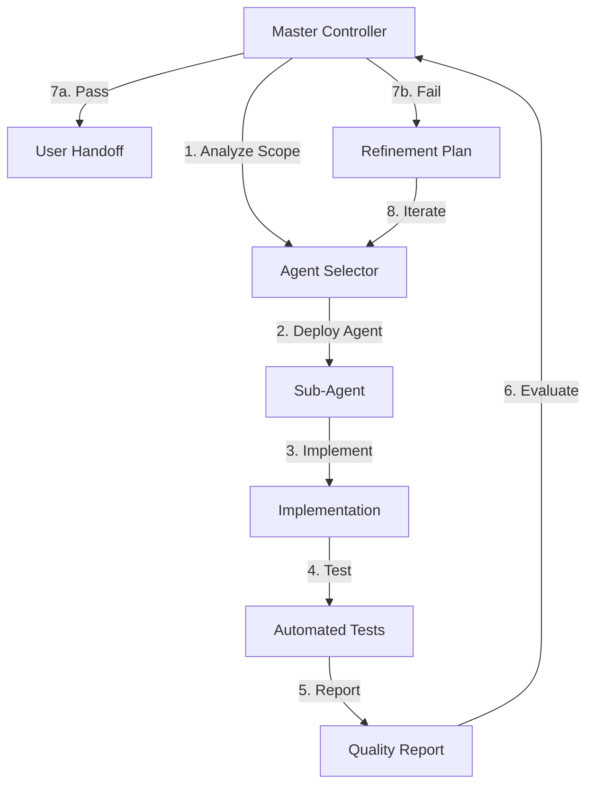

# 🎯 **Master Controller Quality Assurance System**
## **Complete Implementation Guide with Troubleshooting & Agent Selection**

*Created: 2025-01-16*  
*Status: ACTIVE IMPLEMENTATION*  
*Purpose: Master Controller's comprehensive guide for automated quality loops with dynamic agent selection*

---

## 🔄 **ENHANCED FEEDBACK LOOP ARCHITECTURE**

### **Core System Components**



### **Dynamic Agent Selection Matrix**

```typescript
interface AgentSelectionCriteria {
  taskType: 'frontend' | 'backend' | 'ux' | 'testing' | 'integration';
  complexity: 'simple' | 'moderate' | 'complex';
  dependencies: string[];
  requiredSkills: string[];
}

const AGENT_SELECTION_MAP = {
  // Frontend Tasks
  'modal-fix': 'powlax-frontend-developer',
  'ui-enhancement': 'powlax-frontend-developer',
  'component-creation': 'powlax-frontend-developer',
  
  // Backend Tasks
  'database-integration': 'powlax-backend-architect',
  'api-design': 'powlax-backend-architect',
  'performance-optimization': 'powlax-backend-architect',
  
  // UX Tasks
  'workflow-analysis': 'powlax-ux-researcher',
  'mobile-optimization': 'powlax-ux-researcher',
  'age-band-validation': 'powlax-ux-researcher',
  
  // Complex Multi-Domain Tasks
  'full-feature-implementation': 'powlax-master-controller',
  'system-integration': 'powlax-master-controller'
}
```

---

## 📋 **QUALITY CONTROL CHECKLISTS**

### **Pre-Deployment Checklist**
```markdown
## Before Deploying Sub-Agent

### Task Analysis
- [ ] Task scope clearly defined
- [ ] Success criteria specified
- [ ] Test requirements documented
- [ ] Database tables identified
- [ ] Component dependencies mapped

### Agent Selection
- [ ] Correct agent type selected for task
- [ ] Agent capabilities match requirements
- [ ] Backup agent identified if primary fails
- [ ] Iteration strategy defined

### Quality Requirements
- [ ] Build validation required
- [ ] Playwright tests specified
- [ ] Mobile testing required (375px+)
- [ ] Performance criteria set (<3s load)
- [ ] Database integration tests needed
```

### **Post-Implementation Evaluation**
```markdown
## Quality Gate Evaluation

### Build Quality
- [ ] npm run build - PASS/FAIL
- [ ] npm run lint - 0 errors
- [ ] npm run typecheck - No type errors
- [ ] No console errors in browser

### Functional Quality  
- [ ] All user interactions work
- [ ] Modal functionality verified
- [ ] Database connections active
- [ ] Error handling implemented
- [ ] Loading states present

### Performance Quality
- [ ] Page load < 3 seconds
- [ ] Mobile responsive at 375px
- [ ] Touch targets >= 44px
- [ ] Offline capability working

### Test Coverage
- [ ] Unit tests written
- [ ] Integration tests passing
- [ ] E2E Playwright tests created
- [ ] Mobile viewport tested
- [ ] Edge cases covered
```

---

## 🔧 **TROUBLESHOOTING DECISION TREE**

### **Common Issues & Agent Reassignment**

```yaml
Issue: "Modal not opening"
  Primary Agent: powlax-frontend-developer
  Diagnosis:
    - Check: Event handlers attached?
    - Check: State management working?
    - Check: CSS z-index issues?
  If Unresolved:
    - Deploy: powlax-ux-researcher (workflow analysis)
    - Then: powlax-frontend-developer (implementation fix)

Issue: "Data not loading"
  Primary Agent: powlax-backend-architect
  Diagnosis:
    - Check: Database connection active?
    - Check: RLS policies correct?
    - Check: Query syntax valid?
  If Unresolved:
    - Deploy: powlax-backend-architect (debug queries)
    - Then: powlax-frontend-developer (error handling)

Issue: "Mobile layout broken"
  Primary Agent: powlax-frontend-developer
  Diagnosis:
    - Check: Responsive breakpoints?
    - Check: Touch target sizes?
    - Check: Viewport meta tag?
  If Unresolved:
    - Deploy: powlax-ux-researcher (mobile UX analysis)
    - Then: powlax-frontend-developer (responsive fixes)

Issue: "Performance problems"
  Primary Agent: powlax-backend-architect
  Diagnosis:
    - Check: Database indexes?
    - Check: Query optimization?
    - Check: Bundle size?
  If Unresolved:
    - Deploy: powlax-backend-architect (optimize queries)
    - And: powlax-frontend-developer (code splitting)
```

---

## 🎯 **SPECIFIC IMPLEMENTATION TASKS**

### **Practice Planner Fix Sequence**

```markdown
## Task 1: Fix Modal System
Agent: powlax-frontend-developer
Priority: CRITICAL

Requirements:
1. VideoModal - Connect to real drill videos
2. StrategiesModal - Connect to strategies table  
3. LacrosseLabModal - Fix lab URLs
4. LinksModal - Validate all links

Tests Required:
- Modal open/close functionality
- Content loading verification
- Mobile responsiveness (375px)
- Keyboard navigation

Success Criteria:
- All modals open without errors
- Content loads from database
- Mobile touch targets work
- ESC key closes modals
```

```markdown
## Task 2: Database Integration
Agent: powlax-backend-architect
Priority: HIGH

Requirements:
1. Connect useDrills to team_drills table
2. Remove all mock data fallbacks
3. Implement real-time sync
4. Add error handling

Tests Required:
- Database connection tests
- Data loading verification
- Error state handling
- Offline capability

Success Criteria:
- Real drills load from database
- Filters work with real data
- Graceful error handling
- Offline mode functional
```

```markdown
## Task 3: Print Functionality
Agent: powlax-frontend-developer
Priority: MEDIUM

Requirements:
1. Create print-friendly layout
2. Generate PDF on button click
3. Include all practice details
4. Mobile print support

Tests Required:
- Print preview rendering
- PDF generation
- Mobile print testing
- Content completeness

Success Criteria:
- Print button generates PDF
- Layout optimized for paper
- All data included
- Works on mobile devices
```

---

## 📊 **QUALITY METRICS TRACKING**

### **Iteration Tracking Template**

```markdown
## Iteration Report

### Task: [Task Name]
### Agent: [Agent Type]
### Iteration: [1/2/3/etc]

### Previous Issues:
- Issue 1: [Description] - STATUS: [Fixed/Pending]
- Issue 2: [Description] - STATUS: [Fixed/Pending]

### Current Implementation:
- Change 1: [What was done]
- Change 2: [What was done]

### Test Results:
- Build: PASS/FAIL
- Lint: X errors
- Tests: Y/Z passing
- Mobile: PASS/FAIL

### Quality Score: X/100
- Build Quality: X/25
- Functional Quality: X/25  
- Performance: X/25
- Test Coverage: X/25

### Next Steps:
- [ ] If PASS: Present to user
- [ ] If FAIL: Create iteration N+1
```

---

## 🚀 **IMMEDIATE ACTION PLAN**

### **Phase 1: System Activation (Today)**
```bash
1. Implement quality gate evaluation logic
2. Create test orchestration system
3. Set up iteration tracking
4. Define success criteria templates
```

### **Phase 2: Practice Planner Fixes (This Week)**
```bash
1. Deploy modal fix agent with tests
2. Evaluate and iterate until passing
3. Deploy database integration agent
4. Validate complete system integration
```

### **Phase 3: Skills Academy Rebuild (Next Week)**
```bash
1. Apply quality system to Skills Academy
2. Coordinate multiple agents for rebuild
3. Ensure quiz-style interface works
4. Validate point system integration
```

---

## 🔐 **CRITICAL CONTROL POINTS**

### **Never Present to User Unless:**
```markdown
✅ Build compiles without errors
✅ All defined tests pass
✅ Mobile responsiveness verified
✅ Database connections working
✅ Performance under 3 seconds
✅ No console errors present
✅ Quality score >= 80/100
```

### **Automatic Iteration Triggers:**
```markdown
🔄 Build fails to compile
🔄 Any Playwright test fails
🔄 Mobile layout broken
🔄 Database connection errors
🔄 Performance > 3 seconds
🔄 Runtime errors detected
🔄 Quality score < 80/100
```

### **Agent Escalation Path:**
```markdown
1. Initial Agent → 3 iterations max
2. If unresolved → Different specialist agent
3. If still unresolved → Master Controller coordination
4. If critical → User consultation for requirements clarification
```

---

## 📈 **SUCCESS METRICS**

### **System Effectiveness KPIs**
- **First-Pass Success Rate**: Target 70%+
- **Average Iterations**: Target < 2 per task
- **User Re-prompt Rate**: Target < 10%
- **Build Success Rate**: Target 100%
- **Test Coverage**: Target 90%+
- **Mobile Success**: Target 100%
- **Performance**: Target 100% < 3s

### **Weekly Review Metrics**
```markdown
## Week of [Date]

### Tasks Completed: X
### Average Iterations: Y
### First-Pass Success: Z%
### User Satisfaction: [Score]

### Issues Encountered:
- Pattern 1: [Recurring issue type]
- Pattern 2: [Recurring issue type]

### System Improvements:
- Improvement 1: [Enhancement made]
- Improvement 2: [Enhancement made]
```

---

## ✅ **ACTIVATION PROTOCOL**

### **System is ACTIVE when this document exists**

The presence of this document in the codebase means:
1. ✅ All sub-agents must follow quality protocols
2. ✅ No work presented without passing quality gates
3. ✅ Automatic iteration on failures
4. ✅ Dynamic agent selection based on task analysis
5. ✅ Comprehensive testing before user handoff

### **Override Commands**
- `SKIP_QUALITY_GATES`: Emergency bypass (requires user approval)
- `FORCE_ITERATION`: Manual iteration trigger
- `CHANGE_AGENT`: Manual agent reassignment
- `ABORT_TASK`: Cancel current iteration loop

---

## 🎯 **READY FOR DEPLOYMENT**

This quality system ensures:
- **Higher Quality**: Only tested, working code reaches users
- **Fewer Iterations**: Problems caught and fixed automatically
- **Better UX**: Mobile-first, performance-optimized
- **Real Data**: No more mock data or placeholders
- **Comprehensive Testing**: Every change validated

**The Master Controller is now equipped to manage complex multi-agent workflows with automatic quality assurance.**