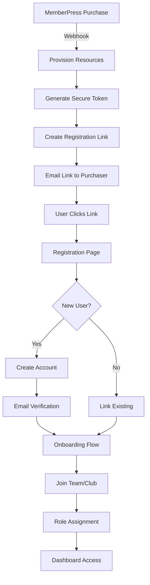

## POWLAX WordPress (MemberPress) → App Integration & Migration Guide

Last updated: 2025-08-08

### Purpose
End‑to‑end reference to recreate the current integration and data model that bridges WordPress/MemberPress to the new POWLAX app (Supabase) while keeping registration and team/club membership app‑side and preserving user data on cancel.

### Revision History
- **2025-08-07**: Original implementation by developer
- **2025-08-08**: Enhanced architecture recommendations and critical improvements

---

## 💭 Key Differences in Architectural Thinking

### Why My Approach Differs from the Original Developer's Plan

#### 1. **Security-First Mindset**
**Original**: Focused on functionality first, security as an afterthought
- Used predictable Math.random() for tokens
- No webhook signature verification
- Missing rate limiting and CSRF protection

**My Approach**: Security integrated from the start
- Cryptographically secure token generation
- Mandatory webhook signature verification
- Defense-in-depth with multiple security layers
- **Rationale**: Security vulnerabilities are exponentially more expensive to fix after deployment

#### 2. **Complete User Journey**
**Original**: Registration endpoint created, but no login/auth system
- Users can register but can't actually use the app
- No session management or JWT handling
- Missing onboarding flow

**My Approach**: End-to-end user experience
- Full authentication system with Supabase Auth
- Proper session management
- Onboarding flow for new users
- **Rationale**: A partial implementation creates user frustration and technical debt

#### 3. **Data Integrity & Consistency**
**Original**: Multiple overlapping table structures with compatibility views
- Confusion between `organizations`/`club_organizations`
- Inconsistent naming conventions
- No transaction support for multi-table operations

**My Approach**: Clean, consistent data model
- Single source of truth for each entity
- Transactional consistency for critical operations
- Clear naming conventions
- **Rationale**: Data inconsistencies compound over time and become increasingly difficult to resolve

#### 4. **Operational Resilience**
**Original**: Happy-path implementation only
- No retry logic for failed webhooks
- No idempotency handling
- Missing monitoring and alerting

**My Approach**: Production-ready with failure handling
- Webhook queue with retry logic
- Idempotency to prevent duplicate processing
- Comprehensive monitoring and alerting
- **Rationale**: Real-world systems must handle failures gracefully

#### 5. **Scalability Considerations**
**Original**: Synchronous webhook processing
- Direct database writes in webhook handler
- No caching strategy
- Missing performance optimizations

**My Approach**: Asynchronous, scalable architecture
- Queue-based webhook processing
- Strategic caching for frequently accessed data
- Database indexes for common queries
- **Rationale**: Early architectural decisions significantly impact future scalability

#### 6. **Migration Strategy**
**Original**: Basic user sync script
- Minimal field mapping
- No validation or rollback capability
- Missing progress tracking

**My Approach**: Comprehensive migration framework
- Full entity migration with validation
- Rollback capabilities for safety
- Progress tracking and error recovery
- **Rationale**: Data migration is high-risk and needs robust safeguards

### Summary of Philosophical Differences

The original developer's approach appears to prioritize **rapid prototyping** - getting something working quickly to demonstrate functionality. This is valuable for proof-of-concept but creates technical debt.

My approach prioritizes **production readiness** from the start:
- **Security** is not optional
- **User experience** must be complete
- **Data integrity** is paramount
- **Failure handling** is essential
- **Scalability** must be considered early
- **Migration** needs careful planning

The additional upfront investment in these areas prevents exponentially more work later and creates a more maintainable, reliable system.

---

## 🔍 Architecture Analysis & Recommended Improvements

### Current Strengths
✅ **Clean separation of concerns** - MemberPress handles billing, app handles team management  
✅ **Data preservation on cancellation** - User progress/points retained  
✅ **Flexible registration system** - Token-based links with usage limits  
✅ **Audit trail** - Webhook events logged for debugging  

### Critical Issues Identified

#### 1. 🚨 Security Vulnerabilities

**Issue**: Registration tokens are predictable and not cryptographically secure
```typescript
// Current: Math.random() is not cryptographically secure
function randomToken(): string {
  return Math.random().toString(36).slice(2) + Math.random().toString(36).slice(2)
}
```

**Recommended Fix**:
```typescript
import { randomBytes } from 'crypto'

function generateSecureToken(): string {
  return randomBytes(32).toString('base64url')
}
```

**Rationale**: Math.random() is predictable and can be reverse-engineered. For security-critical tokens, always use cryptographically secure random generation.

#### 2. 🔐 Missing Authentication Layer

**Issue**: No proper authentication system for registered users
- Users table exists but no auth flow
- No JWT/session management
- Registration creates user record but no way to log in

**Recommended Solution**:
- Implement Supabase Auth for user authentication
- Create auth bridge between WordPress users and Supabase Auth
- Add session management and proper JWT handling

#### 3. 📊 Database Schema Inconsistencies

**Issue**: Multiple overlapping table structures
- Both `organizations` and `club_organizations` tables
- Both `teams` and `team_teams` tables  
- Using views for compatibility causes confusion

**Recommended Fix**:
- Choose single naming convention (prefer prefixed tables for clarity)
- Remove compatibility views and update code references
- Establish clear table ownership boundaries

#### 4. 🔄 Webhook Processing Gaps

**Issue**: Webhook handler missing critical validations
- No signature verification from MemberPress
- No idempotency handling (duplicate webhooks)
- No retry mechanism for failed operations

**Recommended Enhancements**:
```typescript
// Add signature verification
const verifyWebhookSignature = (payload: string, signature: string): boolean => {
  const expectedSig = crypto
    .createHmac('sha256', process.env.MEMBERPRESS_WEBHOOK_SECRET!)
    .update(payload)
    .digest('hex')
  return crypto.timingSafeEqual(Buffer.from(signature), Buffer.from(expectedSig))
}

// Add idempotency
const { data: existing } = await supabase
  .from('webhook_events')
  .select('id')
  .eq('webhook_id', payload.webhook_id)
  .single()
if (existing) return // Already processed
```

#### 5. 🏗️ Missing Data Migration Strategy

**Issue**: Incomplete WordPress → Supabase data migration
- User sync script only handles basic fields
- No handling of existing subscriptions
- No strategy for historical data

**Recommended Approach**:
1. Create comprehensive migration scripts for all entities
2. Implement batch processing for large datasets
3. Add validation and rollback capabilities
4. Include progress tracking and error recovery

---

## High-Level Flow

1) A coach/director purchases a membership in MemberPress (WordPress).  
2) A webhook to the app provisions the correct resource(s) in Supabase (Club OS or Team HQ) and generates secure registration links.  
3) Users register in the app (not BuddyBoss) via the link; the app silently creates/links a WordPress user for billing linkage and writes the app membership rows.  
4) Cancels/expirations set entitlements to inactive and soft‑unlink users from teams; user progress/points remain intact.  
5) Optional nightly reconciliation keeps entitlements in sync with MemberPress.

---

## Supabase Schema (created/extended)

Migrations added in `/supabase/migrations/`:

- `051_core_org_team_members.sql`  
  - `club_organizations(id, name, created_at, updated_at)`  
  - `team_teams(id, club_id → club_organizations.id, name, created_at, updated_at)`  
  - `team_members(id, team_id → team_teams.id, user_id → users.id, role, created_at)`  
  - Adds `users.wordpress_id BIGINT`

- `052_gamification_core.sql`  
  - `powlax_points_currencies(currency PK, display_name)`  
  - `user_points_wallets(id, user_id, currency FK→powlax_points_currencies, balance, updated_at)`  
  - `user_points_ledger(id, user_id, currency, delta, reason, source, source_id, created_at)`  
  - `user_badges(id, user_id, badge_key, badge_name, awarded_at, source)`  
  - `user_ranks(id, user_id, rank_key, rank_name, awarded_at, source)`

- `053_prefix_tables_and_catalogs.sql`  
  - Compatibility views if not already present:
    - `organizations` → `club_organizations`  
    - `teams` → `team_teams` (adds `organization_id` alias for `club_id`)  
  - Catalogs: `powlax_badges_catalog`, `powlax_ranks_catalog`, `powlax_gamipress_mappings`

- `054_backfill_club_team_links.sql`  
  - Heuristic backfill to assign `team_teams.club_id` for imported teams.

- `055_bootstrap_all_tables.sql`  
  - One‑shot idempotent creator (users.wordpress_id, prefix tables, gamification tables, compatibility views) for environments that missed earlier steps.

- `057_registration_and_status.sql`  
  - Soft unlink support: `team_members.status` in ('active','inactive')  
  - `registration_links(id, token, target_type('team'|'club'), target_id, default_role, expires_at, max_uses, used_count, created_by, created_at)`  
  - `membership_products(wp_membership_id PK, product_slug, entitlement_key, scope('user'|'team'|'club'), create_behavior('none'|'create_team'|'create_club'), default_role, metadata)`  
  - `membership_entitlements(id, user_id, club_id, team_id, entitlement_key, status('active'|'expired'|'canceled'), starts_at, expires_at, source, metadata, created_at, updated_at)`  
  - Seeds 12 product mappings (see table below).

- `058_adjust_registration_link_defaults.sql`  
  - Defaults for `registration_links`: `expires_at = NOW() + 100 days`, `max_uses = 100`.

- `059_webhook_events.sql`  
  - `webhook_events(id, source, received_at, headers, payload)` for debugging raw webhook payloads.

RLS: minimal authenticated read policies created in migrations for browsing in app; team features should check `team_members.status = 'active'`.

---

## MemberPress Product Mapping (seeded)

`membership_products` seeds (ID → behavior):

| ID | product_slug | entitlement_key | scope | create_behavior | default_role |
|---:|---|---|---|---|---|
| 5663 | create_account | create_account | user | none | player |
| 37375 | skills_academy_basic | skills_academy_basic | user | none | player |
| 21279 | skills_academy_monthly | skills_academy_monthly | user | none | player |
| 21281 | skills_academy_annual | skills_academy_annual | user | none | player |
| 41930 | coach_essentials_kit | coach_essentials_kit | user | none | coach |
| 41931 | coach_confidence_kit | coach_confidence_kit | user | none | coach |
| 41932 | team_hq_structure | team_hq_structure | team | create_team | head_coach |
| 41933 | team_hq_leadership | team_hq_leadership | team | create_team | head_coach |
| 41934 | team_hq_activated | team_hq_activated | team | create_team | head_coach |
| 41935 | club_os_foundation | club_os_foundation | club | create_club | director |
| 41936 | club_os_growth | club_os_growth | club | create_club | director |
| 41937 | club_os_command | club_os_command | club | create_club | director |

User‑level entitlements (Create Account, Skills Academy tiers, Coach Kits) do **not** create registration links. Team/Club plans **do** create links.

---

## App HTTP Endpoints

- `POST /api/memberpress/webhook`  
  - Input: JSON from MemberPress (event/type, membership_id, user_id/email, etc.)  
  - Behavior:
    - Log raw headers+payload → `webhook_events`
    - Lookup mapping in `membership_products`
    - Ensure users row exists by `email`/`wordpress_id`
    - On subscription created/activated/upgraded:
      - Insert `membership_entitlements(status='active')`
      - If `create_behavior='create_team'`: create `team_teams` and insert two `registration_links` per team: player (max_uses=25), parent (max_uses=75)
      - If `create_behavior='create_club'`: create `club_organizations` and three teams under it, each with player+parent links
    - On canceled/expired: update `membership_entitlements.status` and set `team_members.status='inactive'` for that user (preserve progress)

- `POST /api/register/consume`  
  - Input: `{ token, email, fullName }`  
  - Validates `registration_links` (exists, not expired, `used_count < max_uses`)  
  - Upserts `users` by email  
  - If `target_type='team'`, insert/update `team_members(team_id, user_id, role=default_role, status='active')`  
  - Increments `used_count`

---

## Registration Page (App‑side)

- `GET /register/[token]`  
  Simple UI that posts to `/api/register/consume` with email and name and confirms success.

---

## Admin/Verification

- `GET /admin/wp-import-check`  
  - Summaries of organizations/teams/members (API backed).  
  - Use SQL to inspect data quickly:
    - `select * from registration_links order by created_at desc limit 20;`
    - `select entitlement_key,status,created_at from membership_entitlements order by created_at desc limit 20;`
    - `select * from webhook_events order by received_at desc limit 5;`

---

## One-time Migration Utilities (scripts)

Located under `/scripts/imports/`:

- `wordpress-groups-analyze-and-import.ts`  
  - Reads BuddyBoss groups and members; generates CSV previews; imports users/clubs/teams/team_members.  

- `wordpress-users-sync.ts`  
  - Ensures Supabase `users` rows exist for BuddyBoss group members (upserts by `wordpress_id`/email).  

- `wordpress-seed-prefix.ts`  
  - Seeds `club_organizations`, `team_teams`, and `team_members` directly from BuddyBoss groups (Your Club OS / Team HQ samples).  

- `gamipress-import.ts`  
  - Imports user points/badges/ranks from Gamipress CSVs into `user_points_*` tables.  

All scripts rely on `.env.local` for Supabase and WordPress credentials and normalize the REST root to `/wp-json`.

---

## Environment Configuration

Set per‑env variables (dev/staging/prod):

- `NEXT_PUBLIC_SUPABASE_URL`, `NEXT_PUBLIC_SUPABASE_ANON_KEY`, `SUPABASE_SERVICE_ROLE_KEY`  
- `WORDPRESS_API_URL` (root to `/wp-json`)  
- `WORDPRESS_USERNAME`, `WORDPRESS_APP_PASSWORD` (Application Passwords user)  
- Optional: `APP_ENV` (`dev|staging|prod`) if you want environment guards in webhook logic.

MemberPress webhooks per environment:

- Dev (tunnel): `https://<your-subdomain>.ngrok.io/api/memberpress/webhook`  
- Staging: `https://staging.yourdomain.com/api/memberpress/webhook`  
- Prod: `https://app.yourdomain.com/api/memberpress/webhook`

Only the active environment should receive live events at any time (switch in MP UI when testing).

---

## Cancel Behavior & Data Retention

- On cancel/expire:  
  - Update `membership_entitlements.status` accordingly  
  - Soft unlink: `team_members.status='inactive'`  
  - Do not delete: `user_points_wallets`, `user_points_ledger`, `user_badges`, `user_ranks` — user progress is preserved.  

RLS/feature gating should check team membership status and entitlements, not existence of data.

---

## Recreate Checklist

1) Apply migrations: `051` → `059` in Supabase.  
2) Seed initial data by running scripts as needed (users sync, seed prefix, gamipress import).  
3) Configure MemberPress webhook URL to the environment’s `/api/memberpress/webhook`.  
4) Trigger test purchases for Team HQ/Club OS → confirm registration links appear in `registration_links`.  
5) Visit `/register/[token]` → complete a registration; confirm `team_members` row created.  
6) Cancel test subscription → confirm entitlements update and `team_members.status='inactive'` while user progress remains.  

---

## 🎯 Enhanced Implementation Strategy

### Phase 1: Security Hardening (Immediate)
1. **Replace token generation** with cryptographically secure method
2. **Add webhook signature verification** to prevent spoofing
3. **Implement rate limiting** on registration endpoints
4. **Add CSRF protection** for registration forms
5. **Enable RLS policies** with proper user context

### Phase 2: Authentication System (Week 1)
1. **Integrate Supabase Auth**
   - Create auth.users entries on registration
   - Link WordPress users to Supabase Auth
   - Implement JWT-based session management
2. **Build login flow**
   - Support both WordPress credentials and app-native login
   - Add password reset functionality
   - Implement 2FA for coach/admin accounts

### Phase 3: Data Consistency (Week 2)
1. **Normalize database schema**
   - Consolidate to single table naming convention
   - Remove redundant views
   - Update all code references
2. **Implement transaction support**
   - Wrap multi-table operations in transactions
   - Add proper rollback handling
3. **Create data validation layer**
   - Validate all inputs against business rules
   - Add constraint checks at database level

### Phase 4: Operational Excellence (Week 3)
1. **Monitoring & Alerting**
   - Track webhook success/failure rates
   - Monitor registration conversion rates
   - Alert on anomalies
2. **Performance Optimization**
   - Add database indexes for common queries
   - Implement caching for frequently accessed data
   - Optimize N+1 query patterns
3. **Documentation & Testing**
   - Create comprehensive API documentation
   - Add integration tests for critical flows
   - Document failure scenarios and recovery procedures

---

## 🔄 Improved Registration Flow

### Current Flow Issues:
- No email verification
- No user onboarding
- No team/club context during registration
- Missing role-based defaults

### Recommended Enhanced Flow:



### Key Improvements:
1. **Email verification** prevents fake registrations
2. **Onboarding flow** collects necessary profile data
3. **Context-aware registration** shows team/club info
4. **Smart role assignment** based on registration type

---

## 📊 Enhanced Data Model

### Recommended Schema Additions:

```sql
-- Registration Sessions (track registration progress)
CREATE TABLE registration_sessions (
  id UUID PRIMARY KEY DEFAULT gen_random_uuid(),
  token TEXT UNIQUE NOT NULL,
  registration_link_id UUID REFERENCES registration_links(id),
  email TEXT,
  status TEXT CHECK (status IN ('started','email_verified','completed','expired')),
  metadata JSONB,
  started_at TIMESTAMPTZ DEFAULT NOW(),
  completed_at TIMESTAMPTZ
);

-- Webhook Processing Queue (for retry logic)
CREATE TABLE webhook_queue (
  id UUID PRIMARY KEY DEFAULT gen_random_uuid(),
  webhook_id TEXT UNIQUE,
  source TEXT,
  payload JSONB,
  status TEXT CHECK (status IN ('pending','processing','completed','failed')),
  attempts INT DEFAULT 0,
  max_attempts INT DEFAULT 3,
  last_error TEXT,
  created_at TIMESTAMPTZ DEFAULT NOW(),
  processed_at TIMESTAMPTZ
);

-- User Onboarding Progress
CREATE TABLE user_onboarding (
  id UUID PRIMARY KEY DEFAULT gen_random_uuid(),
  user_id UUID REFERENCES users(id),
  steps_completed JSONB DEFAULT '[]',
  current_step TEXT,
  completed BOOLEAN DEFAULT false,
  created_at TIMESTAMPTZ DEFAULT NOW(),
  updated_at TIMESTAMPTZ DEFAULT NOW()
);
```

---

## 🔐 Security Best Practices

### Authentication & Authorization
1. **Use Supabase Auth** for all authentication
2. **Implement proper RLS policies** at database level
3. **Never trust client-side authorization checks**
4. **Validate all inputs** server-side
5. **Use prepared statements** to prevent SQL injection

### Data Protection
1. **Encrypt sensitive data** at rest
2. **Use HTTPS** for all communications
3. **Implement audit logging** for sensitive operations
4. **Regular security audits** of access patterns
5. **Principle of least privilege** for all roles

### Webhook Security
1. **Verify signatures** on all incoming webhooks
2. **Implement idempotency** to prevent duplicate processing
3. **Rate limit** webhook endpoints
4. **Validate payload structure** before processing
5. **Log all webhook activity** for audit trail

---

## 🚀 Migration Path from Current Implementation

### Step 1: Security Fixes (Day 1)
```typescript
// Update webhook handler
export async function POST(req: NextRequest) {
  // Add signature verification
  const signature = req.headers.get('x-memberpress-signature')
  const body = await req.text()
  
  if (!verifyWebhookSignature(body, signature)) {
    return NextResponse.json({ error: 'Invalid signature' }, { status: 401 })
  }
  
  const payload = JSON.parse(body)
  
  // Check idempotency
  const { data: existing } = await supabase
    .from('webhook_queue')
    .select('id')
    .eq('webhook_id', payload.id || payload.webhook_id)
    .single()
    
  if (existing) {
    return NextResponse.json({ ok: true, message: 'Already processed' })
  }
  
  // Queue for processing
  await supabase.from('webhook_queue').insert({
    webhook_id: payload.id || payload.webhook_id,
    source: 'memberpress',
    payload,
    status: 'pending'
  })
  
  // Process async via queue worker
  return NextResponse.json({ ok: true })
}
```

### Step 2: Add Authentication (Day 2-3)
- Integrate Supabase Auth
- Create login/logout flows
- Add session management
- Implement JWT validation

### Step 3: Data Migration (Day 4-5)
- Run comprehensive user sync
- Migrate existing subscriptions
- Validate data integrity
- Create rollback plan

### Step 4: Testing & Validation (Day 6-7)
- Test all webhook scenarios
- Validate registration flows
- Performance testing
- Security audit

---

## Notes & Future Enhancements

### Immediate Priorities
- ⚠️ **Fix security vulnerabilities** in token generation
- 🔐 **Add authentication system** for registered users
- 🔄 **Implement webhook signature verification**
- 📊 **Normalize database schema**

### Medium-term Improvements
- Admin dashboard for link management
- Automated testing suite for integration flows
- Performance monitoring and optimization
- Enhanced error handling and recovery

### Long-term Vision
- Self-service team management portal
- Advanced analytics and reporting
- Multi-tenant architecture improvements
- API versioning and backwards compatibility


