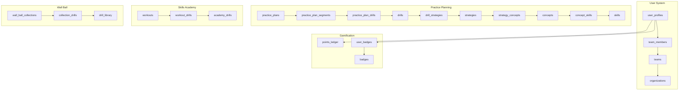

# POWLAX Supabase Tables - Intuitive Understanding

**⚠️ DEPRECATED**: This document contains outdated assumptions. See `/contracts/active/database-truth-sync-002.yaml` for current database truth.

> Based on OUTDATED database analysis - DO NOT USE FOR DEVELOPMENT

## 📊 Database Overview

The POWLAX database appears to be in a transitional state with **38 tables total**, but only **3 tables containing actual data**. This suggests a migration in progress from a WordPress-based system to a modern Supabase architecture.

## 🗂️ Table Categories & Relationships

### 1. 🏋️ **Practice Planning System** (Core Training Architecture)

#### Primary Tables:
- **`drills`** - Central drill library (currently empty)
  - Appears to be the main repository for all training drills
  - Likely connects to strategies through taxonomy system
  
- **`strategies`** - Team plays and tactical approaches (empty)
  - Would contain offensive/defensive plays
  - Connects to concepts for learning progression

- **`concepts`** - Abstract lacrosse principles (empty)
  - Bridge between specific drills and broader skills
  - Educational framework layer

- **`skills`** - Individual player competencies (empty)
  - End goals of training progression
  - What players should master

#### Relationship Tables (4-Tier Taxonomy):
- **`drill_strategies`** - Links drills to strategies they support
- **`strategy_concepts`** - Maps strategies to underlying concepts
- **`concept_skills`** - Connects concepts to skills they develop

**Intuitive Flow**: Drills → Strategies → Concepts → Skills
(Specific exercises build into team plays, which teach concepts, which develop skills)

#### Practice Management:
- **`practice_plans`** - Saved practice sessions (empty)
  - Container for organized training sessions
  
- **`practice_plan_segments`** - Time blocks within practices (empty)
  - Allows practices to be divided into sections (warm-up, drills, scrimmage)
  
- **`practice_plan_drills`** - Drills assigned to segments (empty)
  - Junction table connecting specific drills to practice time slots

- **`practice_templates`** - Reusable practice structures (empty)
  - Pre-built practice formats coaches can duplicate

### 2. 🎯 **Skills Academy System** (Structured Learning Path)

This appears to be a separate, more structured training system:

- **`academy_drills`** - Academy-specific drill library (empty)
  - Curated drills for progressive learning
  
- **`workouts`** - Structured training sessions (empty)
  - Pre-designed sequences of drills
  
- **`workout_drills`** - Links drills to workouts (empty)
  - Junction table for workout composition

### 3. 🥍 **Wall Ball System** (Specialized Training Module)

A complete subsystem for wall ball training (all empty but well-structured):

- **`powlax_wall_ball_drill_library`** - Individual wall ball exercises
  - Specific techniques for wall practice
  
- **`powlax_wall_ball_collections`** - Grouped wall ball workouts
  - Themed collections of wall ball drills
  
- **`powlax_wall_ball_collection_drills`** - Junction table
  - Links individual drills to collections

### 4. 👥 **User & Team Management** (Active System)

**ONLY SECTION WITH REAL DATA:**

- **`teams`** (10 records) - Team entities
  - Connected to clubs/organizations
  - Core organizational unit
  
- **`team_members`** (25 records) - User-team relationships
  - Roles: coach, player, parent
  - Links users to teams
  
- **`user_profiles`** (empty) - Extended user information
  - Would store player stats, preferences
  
- **`team_invitations`** (empty) - Pending team joins
  - Invitation workflow management

### 5. 🏆 **Gamification System** (Engagement Features)

Complete gamification infrastructure (all empty):

- **`points_ledger`** - Transaction log for points
  - Track point earnings/spending
  
- **`badges`** - Achievement definitions
  - Available badges to earn
  
- **`user_badges`** (exists but empty) - Earned badges
  - User-badge relationships
  
- **`achievements`** - Broader achievement system
  - Milestone tracking beyond badges

### 6. 📝 **Assessment System** (Knowledge Testing)

Quiz and evaluation framework (all empty):

- **`quizzes`** - Quiz definitions
- **`quiz_questions`** - Individual questions
- **`quiz_responses`** - User answers

### 7. 🔐 **Authentication System** (Registration Focus)

- **`registration_links`** (10 records) - Active registration tokens
  - Pre-authorized registration links
  - Target teams/roles specified
  
- **`webhook_events`** (empty) - External system integration
  - Would track WordPress/MemberPress events

### 8. 🔄 **Migration/Legacy Tables** (WordPress Transition)

Parallel "powlax" prefixed tables suggest data migration:

- **`drills_powlax`** - Legacy drill data (empty)
- **`strategies_powlax`** - Legacy strategies (empty)
- **`skills_academy_powlax`** - Old academy data (empty)
- **`powlax_skills_academy_workouts`** - Transitional workout data (empty)
- **`powlax_skills_academy_drills`** - Transitional drill data (empty)
- **`powlax_skills_academy_questions`** - Quiz migration (empty)
- **`powlax_skills_academy_answers`** - Answer migration (empty)

WordPress user migration tables:
- **`wordpress_groups`** - Group definitions (empty)
- **`wordpress_group_members`** - Membership data (empty)

## 🔗 Key Relationships & Patterns

### 1. **Dual System Architecture**
- Main system tables (drills, strategies, etc.)
- Legacy "powlax_" prefixed tables
- Suggests phased migration approach

### 2. **Three Training Paradigms**
- **Practice Planning**: Flexible, coach-driven (drills → strategies → concepts → skills)
- **Skills Academy**: Structured curriculum (workouts with predetermined drills)
- **Wall Ball**: Specialized skill module (collections of specific exercises)

### 3. **Hierarchical Organization**
```
Organizations/Clubs
    └── Teams (10 active)
        └── Team Members (25 active)
            └── User Profiles (awaiting population)
```

### 4. **Activity State**
- **Active**: Team management, registration system
- **Prepared**: All training systems, gamification, assessments
- **Legacy**: WordPress migration tables

## 💡 Insights & Observations

### Current State Analysis:
1. **Team Infrastructure First**: The only populated tables are teams and team_members, suggesting the platform started with organizational structure

2. **Registration System Active**: 10 registration links exist, indicating active onboarding

3. **Content Migration Pending**: Empty legacy tables suggest WordPress content hasn't been migrated yet

4. **Well-Architected but Unpopulated**: The schema is comprehensive and well-thought-out, just lacking data

### Intended User Flow:
1. Users register via registration links → Join teams
2. Coaches create practice plans using drills/strategies
3. Players complete Skills Academy workouts
4. Progress tracked through gamification (points/badges)
5. Knowledge validated through quizzes

### Database Design Patterns:
- **Junction Tables**: Proper many-to-many relationships (drill_strategies, workout_drills)
- **Taxonomy System**: 4-tier educational hierarchy
- **Modular Systems**: Separate but related training modules
- **Audit Trail Ready**: Timestamps on all tables
- **Multi-tenancy**: Team-based data isolation

## 🚀 Recommendations for Population

### Priority 1: Core Content
1. Import drills from WordPress (`drills_powlax` → `drills`)
2. Import strategies (`strategies_powlax` → `strategies`)
3. Establish drill-strategy relationships

### Priority 2: Skills Academy
1. Populate academy workouts
2. Link workouts to drills
3. Enable workout progression tracking

### Priority 3: User Experience
1. Complete user profile data
2. Enable gamification features
3. Activate assessment system

### Priority 4: Advanced Features
1. Practice planning templates
2. Team playbooks
3. Analytics and reporting

## 🎯 Connection Map



## 📌 Summary

The POWLAX database is a well-designed system in transition. The architecture supports comprehensive lacrosse training management with multiple learning paradigms, team organization, and engagement features. The current state shows infrastructure readiness with active team management but awaiting content population from the WordPress migration. The dual-table structure (main + legacy) indicates a thoughtful migration strategy to preserve existing data while building a modern platform.